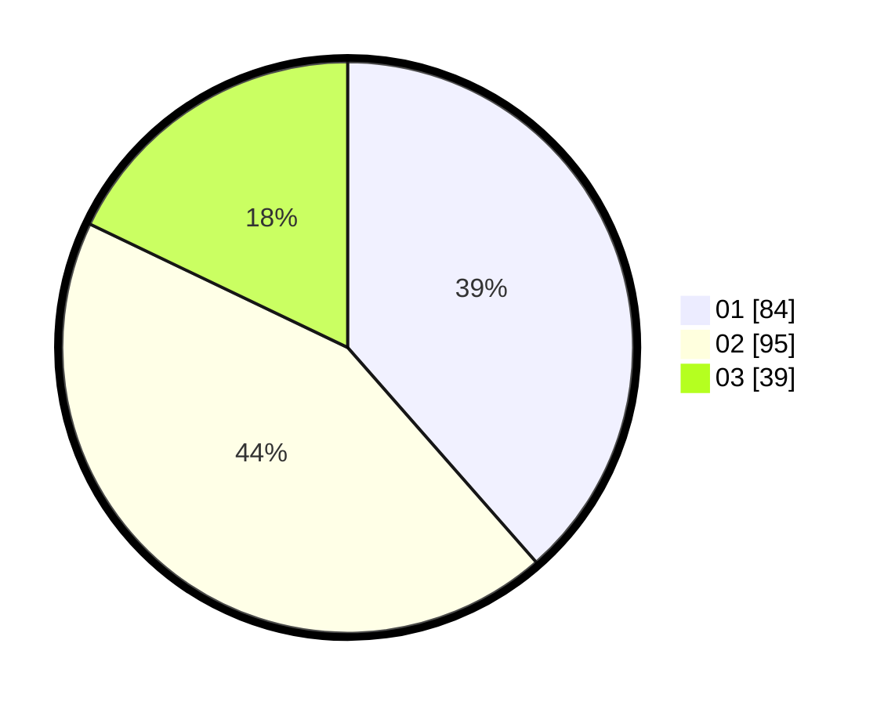

# Hasil

Hasil perolehan suara paslon dapat dilihat pada file paslon-01.txt, paslon-02.txt, dan paslon-03.txt.

Jika tidak ada, artinya data tersebut belum ada pada SIREKAP.

## Perolehan Suara

 * Paslon 01: **84**.
 * Paslon 02: **95**.
 * Paslon 03: **39**.

## Foto C Plano

https://sirekap-obj-formc.kpu.go.id/6239/pemilu/ppwp/31/75/07/10/04/3175071004247-20240218-173452--1a9396a9-966c-4a13-a9ae-1071107533c8.jpg

https://sirekap-obj-formc.kpu.go.id/6239/pemilu/ppwp/31/75/07/10/04/3175071004247-20240215-011557--ffbf3df1-17af-4f93-b2b4-0b01fcfbfe48.jpg

https://sirekap-obj-formc.kpu.go.id/6239/pemilu/ppwp/31/75/07/10/04/3175071004247-20240215-011739--09476451-f87c-44a5-b41a-80471929dcf5.jpg
