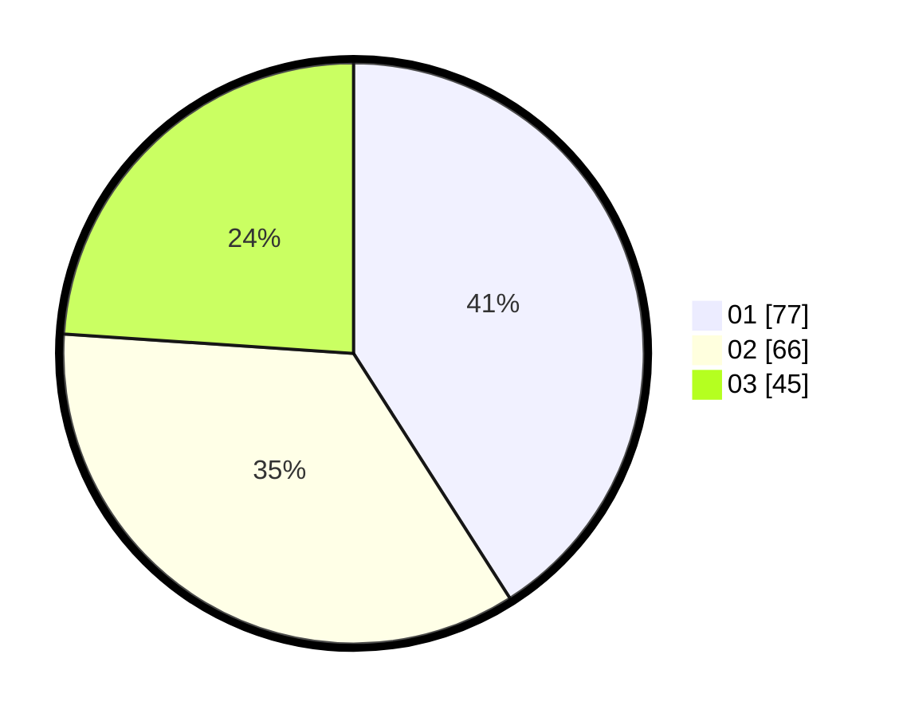

# Hasil

Hasil perolehan suara paslon dapat dilihat pada file paslon-01.txt, paslon-02.txt, dan paslon-03.txt.

Jika tidak ada, artinya data tersebut belum ada pada SIREKAP.

## Perolehan Suara

 * Paslon 01: **77**.
 * Paslon 02: **66**.
 * Paslon 03: **45**.

## Foto C Plano

https://sirekap-obj-formc.kpu.go.id/988f/pemilu/ppwp/31/75/07/10/04/3175071004249-20240214-222833--60e303fa-b2ff-4d18-abf9-b30c47cac5a3.jpg

https://sirekap-obj-formc.kpu.go.id/988f/pemilu/ppwp/31/75/07/10/04/3175071004249-20240215-004111--1b20329a-ad90-44de-84f6-0f2f3b589793.jpg

https://sirekap-obj-formc.kpu.go.id/988f/pemilu/ppwp/31/75/07/10/04/3175071004249-20240215-004041--8931993b-537b-4c3b-8b15-a8fee8e64dc4.jpg
