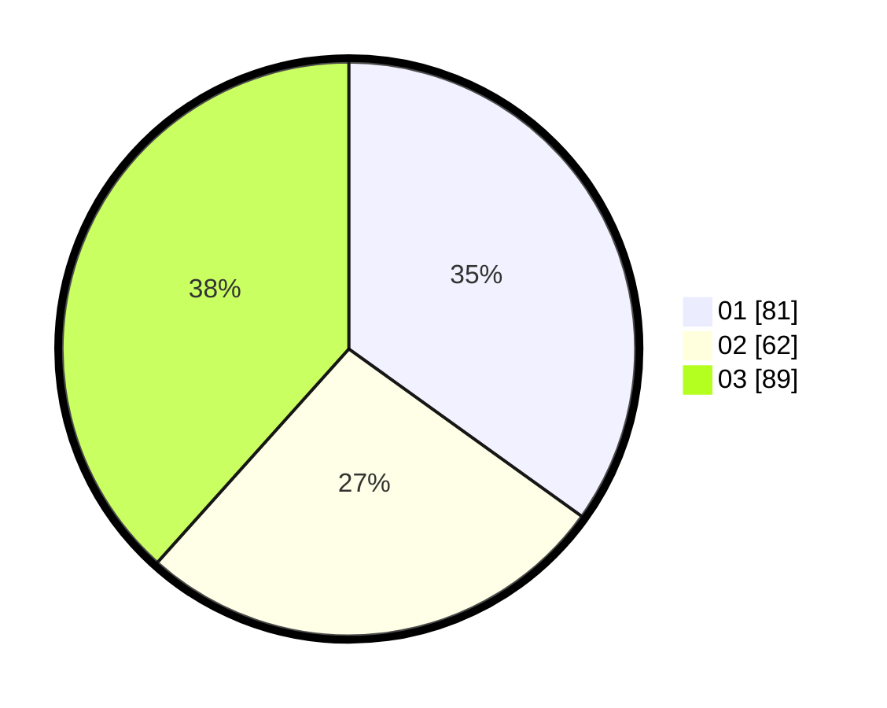

# Hasil

Hasil perolehan suara paslon dapat dilihat pada file paslon-01.txt, paslon-02.txt, dan paslon-03.txt.

Jika tidak ada, artinya data tersebut belum ada pada SIREKAP.

## Perolehan Suara

 * Paslon 01: **81**.
 * Paslon 02: **62**.
 * Paslon 03: **89**.

## Foto C Plano

https://sirekap-obj-formc.kpu.go.id/fb6b/pemilu/ppwp/31/75/07/10/04/3175071004250-20240214-223806--8d562153-526c-4cc8-b4cc-c08a11bbef0d.jpg

https://sirekap-obj-formc.kpu.go.id/fb6b/pemilu/ppwp/31/75/07/10/04/3175071004250-20240214-224603--e21a7cd1-fbed-4f8b-a7ea-d205c3f7a279.jpg

https://sirekap-obj-formc.kpu.go.id/fb6b/pemilu/ppwp/31/75/07/10/04/3175071004250-20240214-224836--52bfb633-3a4f-4bfd-8bcc-08514128261e.jpg
