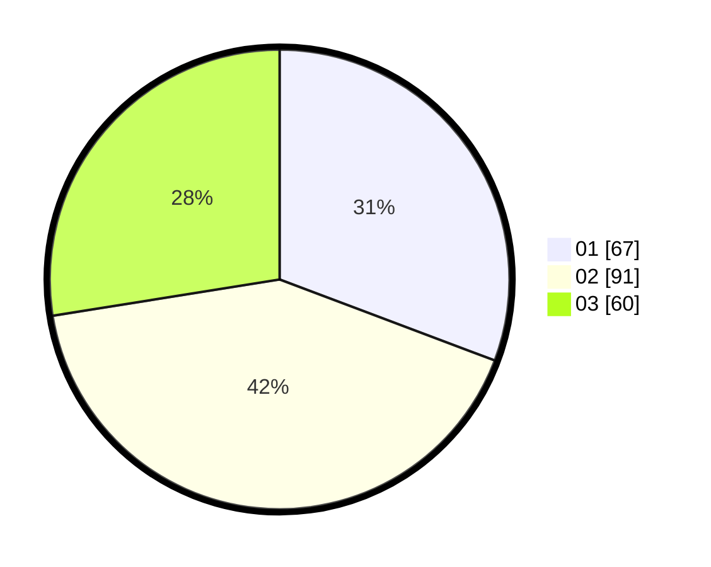

# Hasil

Hasil perolehan suara paslon dapat dilihat pada file paslon-01.txt, paslon-02.txt, dan paslon-03.txt.

Jika tidak ada, artinya data tersebut belum ada pada SIREKAP.

## Perolehan Suara

 * Paslon 01: **67**.
 * Paslon 02: **91**.
 * Paslon 03: **60**.

## Foto C Plano

https://sirekap-obj-formc.kpu.go.id/0953/pemilu/ppwp/31/75/07/10/04/3175071004254-20240215-160056--c25aba56-941c-45f4-b10d-e10dfa9360d3.jpg

https://sirekap-obj-formc.kpu.go.id/0953/pemilu/ppwp/31/75/07/10/04/3175071004254-20240214-184737--c8b06bd7-4b82-4e0b-9b07-7c7bd92da7b9.jpg

https://sirekap-obj-formc.kpu.go.id/0953/pemilu/ppwp/31/75/07/10/04/3175071004254-20240214-185935--025f7a70-65b1-4b93-a971-e61b81161058.jpg

## DATA PEMILIH TETAP

Jumlah pemilih dalam DPT: **253**.
 * L: **126**.
 * P: **127**.

## DATA PENGGUNA HAK PILIH

Jumlah pengguna hak pilih dalam DPT: **211**.
 * L: **107**.
 * P: **104**.

Jumlah pengguna hak pilih dalam DPTb: **6**.
 * L: **1**.
 * P: **5**.

Jumlah pengguna hak pilih dalam DPK: **3**.
 * L: **1**.
 * P: **2**.

Jumlah pengguna hak pilih: **220**.
 * L: **109**.
 * P: **111**.

## JUMLAH SUARA SAH DAN TIDAK SAH

JUMLAH SELURUH SUARA SAH: **218**.

JUMLAH SUARA TIDAK SAH: **2**.

JUMLAH SELURUH SUARA SAH DAN SUARA TIDAK SAH: **220**.
