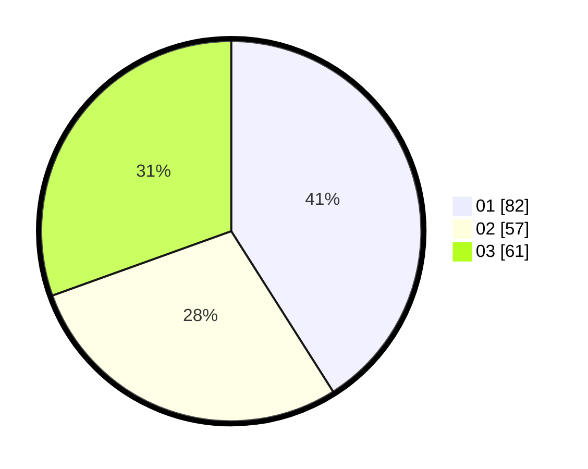

# Hasil

Hasil perolehan suara paslon dapat dilihat pada file paslon-01.txt, paslon-02.txt, dan paslon-03.txt.

Jika tidak ada, artinya data tersebut belum ada pada SIREKAP.

## Perolehan Suara

 * Paslon 01: **82**.
 * Paslon 02: **57**.
 * Paslon 03: **61**.

## Foto C Plano

https://sirekap-obj-formc.kpu.go.id/c074/pemilu/ppwp/31/75/07/10/04/3175071004255-20240215-025424--29acb7b7-d602-471d-99f5-d74d815a42eb.jpg

https://sirekap-obj-formc.kpu.go.id/c074/pemilu/ppwp/31/75/07/10/04/3175071004255-20240215-025634--b9f97cda-c4d2-489e-befd-5200e2c09573.jpg

https://sirekap-obj-formc.kpu.go.id/c074/pemilu/ppwp/31/75/07/10/04/3175071004255-20240215-030118--64b69e6f-f2de-4db3-a9d7-215eff573a1b.jpg
