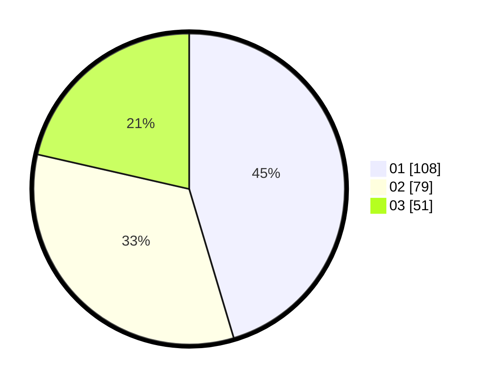

# Hasil

Hasil perolehan suara paslon dapat dilihat pada file paslon-01.txt, paslon-02.txt, dan paslon-03.txt.

Jika tidak ada, artinya data tersebut belum ada pada SIREKAP.

## Perolehan Suara

 * Paslon 01: **108**.
 * Paslon 02: **79**.
 * Paslon 03: **51**.

## Foto C Plano

https://sirekap-obj-formc.kpu.go.id/a17f/pemilu/ppwp/31/75/07/10/04/3175071004258-20240214-191125--54cf46d0-287c-478e-b11f-fd20c92096a5.jpg

https://sirekap-obj-formc.kpu.go.id/a17f/pemilu/ppwp/31/75/07/10/04/3175071004258-20240214-192322--9715449e-9fca-4d39-8982-b89eaf17f5b7.jpg

https://sirekap-obj-formc.kpu.go.id/a17f/pemilu/ppwp/31/75/07/10/04/3175071004258-20240214-190601--e338f071-826f-469b-a310-af01c10e6aa9.jpg

## DATA PEMILIH TETAP

Jumlah pemilih dalam DPT: **291**.
 * L: **138**.
 * P: **153**.

## DATA PENGGUNA HAK PILIH

Jumlah pengguna hak pilih dalam DPT: **235**.
 * L: **110**.
 * P: **125**.

Jumlah pengguna hak pilih dalam DPTb: **7**.
 * L: **1**.
 * P: **6**.

Jumlah pengguna hak pilih dalam DPK: **2**.
 * L: **1**.
 * P: **1**.

Jumlah pengguna hak pilih: **244**.
 * L: **112**.
 * P: **132**.

## JUMLAH SUARA SAH DAN TIDAK SAH

JUMLAH SELURUH SUARA SAH: **238**.

JUMLAH SUARA TIDAK SAH: **6**.

JUMLAH SELURUH SUARA SAH DAN SUARA TIDAK SAH: **244**.
