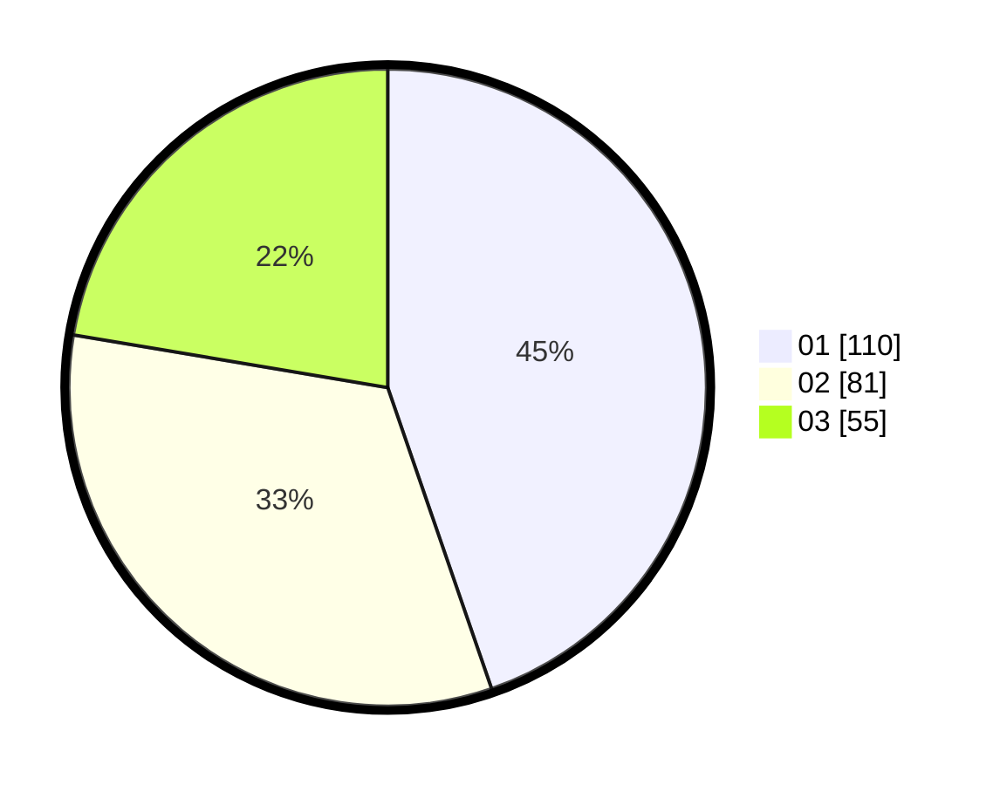

# Hasil

Hasil perolehan suara paslon dapat dilihat pada file paslon-01.txt, paslon-02.txt, dan paslon-03.txt.

Jika tidak ada, artinya data tersebut belum ada pada SIREKAP.

## Perolehan Suara

 * Paslon 01: **110**.
 * Paslon 02: **81**.
 * Paslon 03: **55**.

## Foto C Plano

https://sirekap-obj-formc.kpu.go.id/344e/pemilu/ppwp/31/75/07/10/04/3175071004259-20240214-185030--adbdf7fe-ec11-47b4-99a5-ac385be3a8c9.jpg

https://sirekap-obj-formc.kpu.go.id/344e/pemilu/ppwp/31/75/07/10/04/3175071004259-20240214-203538--3a4dab84-d46a-42a5-99c6-8535d645f6cd.jpg

https://sirekap-obj-formc.kpu.go.id/344e/pemilu/ppwp/31/75/07/10/04/3175071004259-20240214-185042--2a7500eb-e735-46c4-8805-96da60591733.jpg

## DATA PEMILIH TETAP

Jumlah pemilih dalam DPT: **292**.
 * L: **132**.
 * P: **160**.

## DATA PENGGUNA HAK PILIH

Jumlah pengguna hak pilih dalam DPT: **238**.
 * L: **105**.
 * P: **133**.

Jumlah pengguna hak pilih dalam DPTb: **10**.
 * L: **5**.
 * P: **5**.

Jumlah pengguna hak pilih dalam DPK: **0**.
 * L: **0**.
 * P: **0**.

Jumlah pengguna hak pilih: **248**.
 * L: **110**.
 * P: **138**.

## JUMLAH SUARA SAH DAN TIDAK SAH

JUMLAH SELURUH SUARA SAH: **246**.

JUMLAH SUARA TIDAK SAH: **2**.

JUMLAH SELURUH SUARA SAH DAN SUARA TIDAK SAH: **248**.
