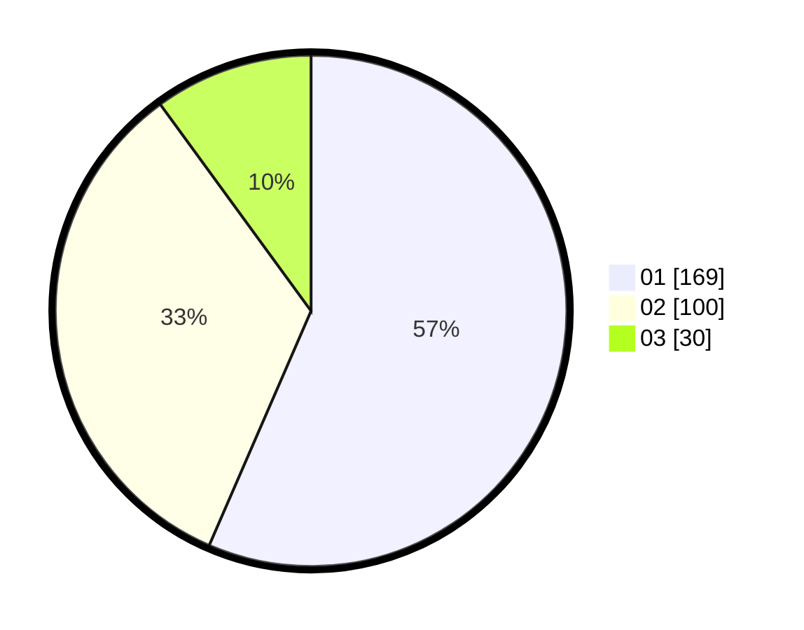

# Hasil

Hasil perolehan suara paslon dapat dilihat pada file paslon-01.txt, paslon-02.txt, dan paslon-03.txt.

Jika tidak ada, artinya data tersebut belum ada pada SIREKAP.

## Perolehan Suara

 * Paslon 01: **169**.
 * Paslon 02: **100**.
 * Paslon 03: **30**.

## Foto C Plano

https://sirekap-obj-formc.kpu.go.id/2981/pemilu/ppwp/31/75/07/10/04/3175071004261-20240214-215552--b7b53123-d035-40fa-9a30-5dcaf3452285.jpg

https://sirekap-obj-formc.kpu.go.id/2981/pemilu/ppwp/31/75/07/10/04/3175071004261-20240216-141116--0d75687e-e1c8-4228-8ec6-c478a928c790.jpg

https://sirekap-obj-formc.kpu.go.id/2981/pemilu/ppwp/31/75/07/10/04/3175071004261-20240214-215731--be85d99f-a9b3-4dd8-90ac-0c9e2ec5baac.jpg

## DATA PEMILIH TETAP

Jumlah pemilih dalam DPT: **304**.
 * L: **148**.
 * P: **156**.

## DATA PENGGUNA HAK PILIH

Jumlah pengguna hak pilih dalam DPT: **266**.
 * L: **134**.
 * P: **132**.

Jumlah pengguna hak pilih dalam DPTb: **17**.
 * L: **4**.
 * P: **13**.

Jumlah pengguna hak pilih dalam DPK: **21**.
 * L: **10**.
 * P: **11**.

Jumlah pengguna hak pilih: **304**.
 * L: **148**.
 * P: **156**.

## JUMLAH SUARA SAH DAN TIDAK SAH

JUMLAH SELURUH SUARA SAH: **299**.

JUMLAH SUARA TIDAK SAH: **5**.

JUMLAH SELURUH SUARA SAH DAN SUARA TIDAK SAH: **304**.
