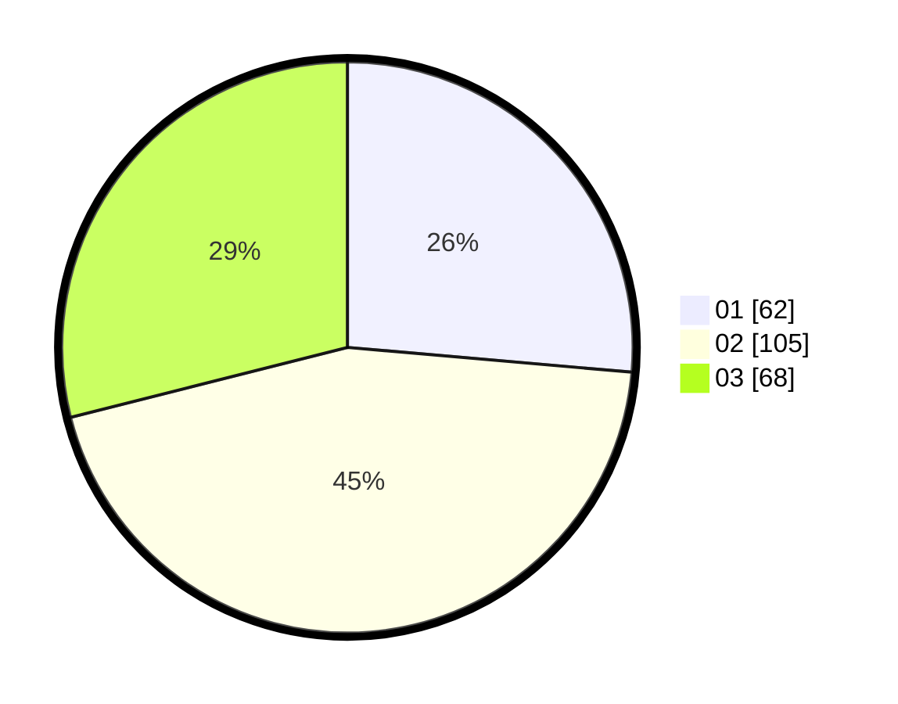

# Hasil

Hasil perolehan suara paslon dapat dilihat pada file paslon-01.txt, paslon-02.txt, dan paslon-03.txt.

Jika tidak ada, artinya data tersebut belum ada pada SIREKAP.

## Perolehan Suara

 * Paslon 01: **62**.
 * Paslon 02: **105**.
 * Paslon 03: **68**.

## Foto C Plano

https://sirekap-obj-formc.kpu.go.id/b5d4/pemilu/ppwp/31/75/07/10/05/3175071005003-20240216-194837--b601f575-b17c-4924-a8a1-b4daad920f0d.jpg

https://sirekap-obj-formc.kpu.go.id/b5d4/pemilu/ppwp/31/75/07/10/05/3175071005003-20240216-203114--2e01c0b8-769f-45ee-a43c-fdbd757c308e.jpg

https://sirekap-obj-formc.kpu.go.id/b5d4/pemilu/ppwp/31/75/07/10/05/3175071005003-20240216-195520--3c114600-3646-4b82-8a34-7130d0b14546.jpg
