# Hasil

Hasil perolehan suara paslon dapat dilihat pada file paslon-01.txt, paslon-02.txt, dan paslon-03.txt.

Jika tidak ada, artinya data tersebut belum ada pada SIREKAP.

## Perolehan Suara

 * Paslon 01: **39**.
 * Paslon 02: **116**.
 * Paslon 03: **76**.

```mermaid
%%{init: {"pie": {"textPosition": 0.5}, "themeVariables": {"pieOuterStrokeWidth": "5px"}} }%%
pie showData
    "01" : 39
    "02" : 116
    "03" : 76
```

## Foto C Plano

https://sirekap-obj-formc.kpu.go.id/4532/pemilu/ppwp/31/75/07/10/05/3175071005005-20240216-023921--023ffc62-2480-4679-8112-44364ddd89c2.jpg

https://sirekap-obj-formc.kpu.go.id/4532/pemilu/ppwp/31/75/07/10/05/3175071005005-20240216-022451--ebbe1cb4-5639-4733-97de-72e75bff3cf6.jpg

https://sirekap-obj-formc.kpu.go.id/4532/pemilu/ppwp/31/75/07/10/05/3175071005005-20240216-023931--95ea925b-7450-4674-8057-271d565bae55.jpg

## DATA PEMILIH TETAP

Jumlah pemilih dalam DPT: **279**.
 * L: **125**.
 * P: **154**.

## DATA PENGGUNA HAK PILIH

Jumlah pengguna hak pilih dalam DPT: **223**.
 * L: **98**.
 * P: **125**.

Jumlah pengguna hak pilih dalam DPTb: **7**.
 * L: **4**.
 * P: **3**.

Jumlah pengguna hak pilih dalam DPK: **1**.
 * L: **1**.
 * P: **0**.

Jumlah pengguna hak pilih: **231**.
 * L: **103**.
 * P: **128**.

## JUMLAH SUARA SAH DAN TIDAK SAH

JUMLAH SELURUH SUARA SAH: **231**.

JUMLAH SUARA TIDAK SAH: **0**.

JUMLAH SELURUH SUARA SAH DAN SUARA TIDAK SAH: **231**.
