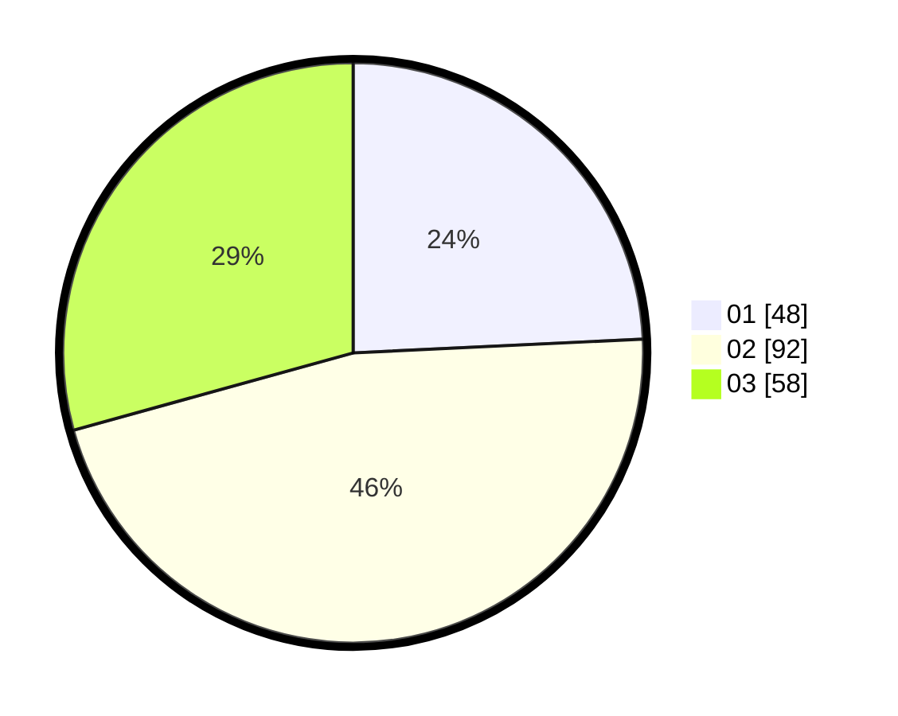

# Hasil

Hasil perolehan suara paslon dapat dilihat pada file paslon-01.txt, paslon-02.txt, dan paslon-03.txt.

Jika tidak ada, artinya data tersebut belum ada pada SIREKAP.

## Perolehan Suara

 * Paslon 01: **48**.
 * Paslon 02: **92**.
 * Paslon 03: **58**.

## Foto C Plano

https://sirekap-obj-formc.kpu.go.id/5337/pemilu/ppwp/31/75/07/10/05/3175071005006-20240214-211313--985a34a9-d365-469e-94aa-e732c18b62e1.jpg

https://sirekap-obj-formc.kpu.go.id/5337/pemilu/ppwp/31/75/07/10/05/3175071005006-20240214-211419--9e7b8367-c1ed-48dd-a072-6fae6cce5549.jpg

https://sirekap-obj-formc.kpu.go.id/5337/pemilu/ppwp/31/75/07/10/05/3175071005006-20240214-211540--f83428bc-cbe8-4d8c-b01b-bef47b314254.jpg

## DATA PEMILIH TETAP

Jumlah pemilih dalam DPT: **274**.
 * L: **142**.
 * P: **132**.

## DATA PENGGUNA HAK PILIH

Jumlah pengguna hak pilih dalam DPT: **241**.
 * L: **122**.
 * P: **119**.

Jumlah pengguna hak pilih dalam DPTb: **0**.
 * L: **0**.
 * P: **0**.

Jumlah pengguna hak pilih dalam DPK: **9**.
 * L: **3**.
 * P: **6**.

Jumlah pengguna hak pilih: **250**.
 * L: **125**.
 * P: **125**.

## JUMLAH SUARA SAH DAN TIDAK SAH

JUMLAH SELURUH SUARA SAH: **248**.

JUMLAH SUARA TIDAK SAH: **2**.

JUMLAH SELURUH SUARA SAH DAN SUARA TIDAK SAH: **250**.
