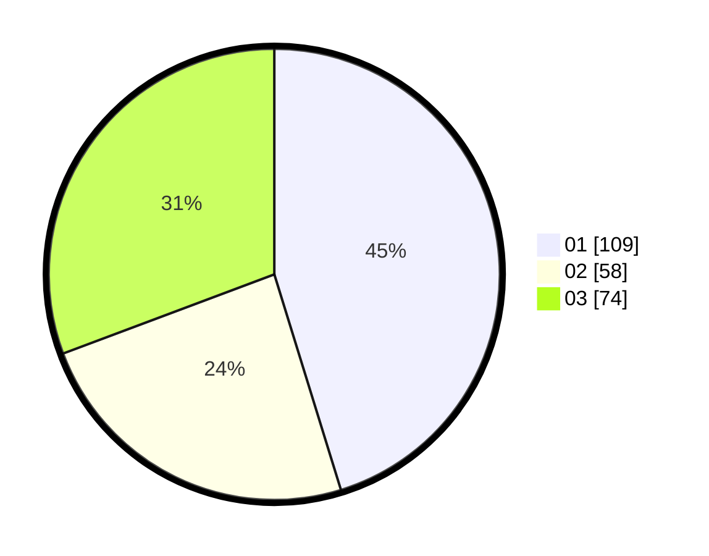

# Hasil

Hasil perolehan suara paslon dapat dilihat pada file paslon-01.txt, paslon-02.txt, dan paslon-03.txt.

Jika tidak ada, artinya data tersebut belum ada pada SIREKAP.

## Perolehan Suara

 * Paslon 01: **109**.
 * Paslon 02: **58**.
 * Paslon 03: **74**.

## Foto C Plano

https://sirekap-obj-formc.kpu.go.id/a1a4/pemilu/ppwp/31/75/07/10/05/3175071005009-20240214-190446--965db0ae-27bc-4fab-ad80-302495f4f219.jpg

https://sirekap-obj-formc.kpu.go.id/a1a4/pemilu/ppwp/31/75/07/10/05/3175071005009-20240214-190505--6791e954-06e6-499b-8789-87647a07db47.jpg

https://sirekap-obj-formc.kpu.go.id/a1a4/pemilu/ppwp/31/75/07/10/05/3175071005009-20240214-190521--3fb1413c-908f-4681-b512-5b35b286dbc2.jpg
