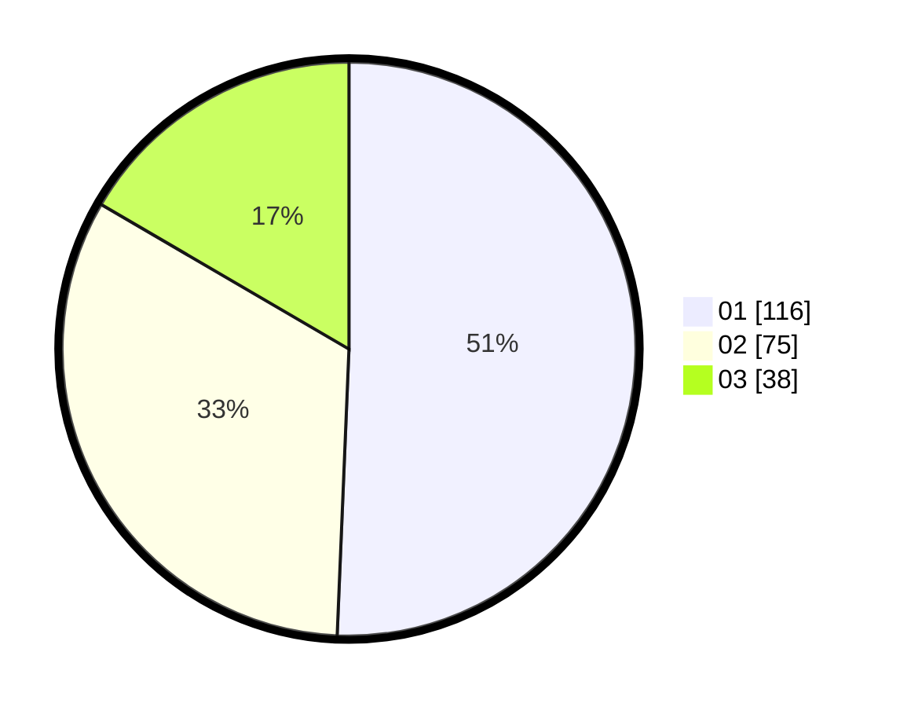

# Hasil

Hasil perolehan suara paslon dapat dilihat pada file paslon-01.txt, paslon-02.txt, dan paslon-03.txt.

Jika tidak ada, artinya data tersebut belum ada pada SIREKAP.

## Perolehan Suara

 * Paslon 01: **116**.
 * Paslon 02: **75**.
 * Paslon 03: **38**.

## Foto C Plano

https://sirekap-obj-formc.kpu.go.id/939e/pemilu/ppwp/31/75/07/10/05/3175071005019-20240214-193005--b64d33d9-a2a6-48ce-be86-7567d204dcb0.jpg

https://sirekap-obj-formc.kpu.go.id/939e/pemilu/ppwp/31/75/07/10/05/3175071005019-20240214-193402--2ee7d23a-637b-40c3-8dbc-70ecac3f6186.jpg

https://sirekap-obj-formc.kpu.go.id/939e/pemilu/ppwp/31/75/07/10/05/3175071005019-20240214-193808--d0780a89-cb68-409d-9edb-f73ca6b05169.jpg

## DATA PEMILIH TETAP

Jumlah pemilih dalam DPT: **292**.
 * L: **148**.
 * P: **144**.

## DATA PENGGUNA HAK PILIH

Jumlah pengguna hak pilih dalam DPT: **233**.
 * L: **120**.
 * P: **113**.

Jumlah pengguna hak pilih dalam DPTb: **0**.
 * L: **0**.
 * P: **0**.

Jumlah pengguna hak pilih dalam DPK: **2**.
 * L: **1**.
 * P: **1**.

Jumlah pengguna hak pilih: **235**.
 * L: **121**.
 * P: **114**.

## JUMLAH SUARA SAH DAN TIDAK SAH

JUMLAH SELURUH SUARA SAH: **229**.

JUMLAH SUARA TIDAK SAH: **6**.

JUMLAH SELURUH SUARA SAH DAN SUARA TIDAK SAH: **235**.
