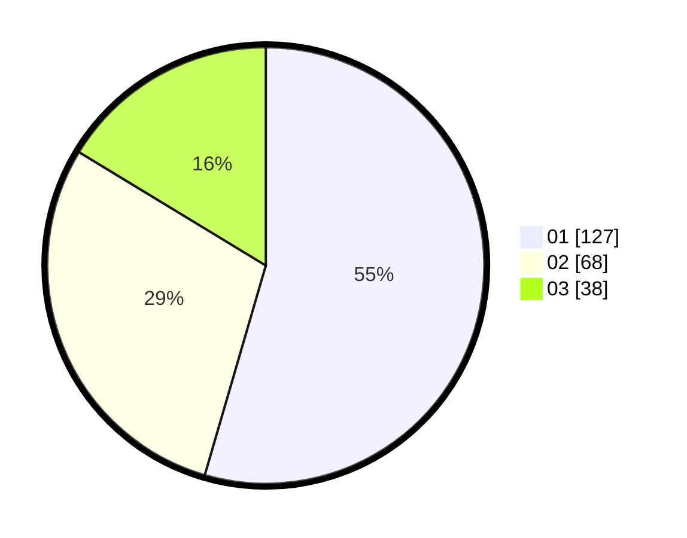

# Hasil

Hasil perolehan suara paslon dapat dilihat pada file paslon-01.txt, paslon-02.txt, dan paslon-03.txt.

Jika tidak ada, artinya data tersebut belum ada pada SIREKAP.

## Perolehan Suara

 * Paslon 01: **127**.
 * Paslon 02: **68**.
 * Paslon 03: **38**.

## Foto C Plano

https://sirekap-obj-formc.kpu.go.id/b253/pemilu/ppwp/31/75/07/10/05/3175071005020-20240214-155127--52e98e08-426a-4932-ab4c-85e576034c3e.jpg

https://sirekap-obj-formc.kpu.go.id/b253/pemilu/ppwp/31/75/07/10/05/3175071005020-20240214-155532--8f124af4-366f-4531-b625-55cf08588abd.jpg

https://sirekap-obj-formc.kpu.go.id/b253/pemilu/ppwp/31/75/07/10/05/3175071005020-20240214-155800--dcd685f6-d2b2-4071-8ee7-b9f6de39498f.jpg

## DATA PEMILIH TETAP

Jumlah pemilih dalam DPT: **288**.
 * L: **130**.
 * P: **158**.

## DATA PENGGUNA HAK PILIH

Jumlah pengguna hak pilih dalam DPT: **229**.
 * L: **102**.
 * P: **127**.

Jumlah pengguna hak pilih dalam DPTb: **4**.
 * L: **0**.
 * P: **4**.

Jumlah pengguna hak pilih dalam DPK: **1**.
 * L: **1**.
 * P: **0**.

Jumlah pengguna hak pilih: **234**.
 * L: **103**.
 * P: **131**.

## JUMLAH SUARA SAH DAN TIDAK SAH

JUMLAH SELURUH SUARA SAH: **233**.

JUMLAH SUARA TIDAK SAH: **1**.

JUMLAH SELURUH SUARA SAH DAN SUARA TIDAK SAH: **234**.
