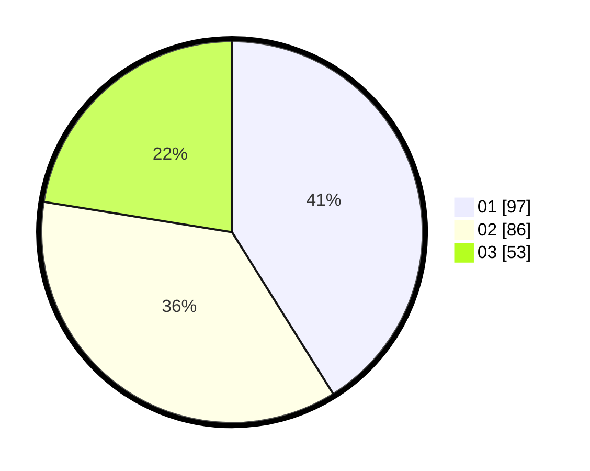

# Hasil

Hasil perolehan suara paslon dapat dilihat pada file paslon-01.txt, paslon-02.txt, dan paslon-03.txt.

Jika tidak ada, artinya data tersebut belum ada pada SIREKAP.

## Perolehan Suara

 * Paslon 01: **97**.
 * Paslon 02: **86**.
 * Paslon 03: **53**.

## Foto C Plano

https://sirekap-obj-formc.kpu.go.id/57d3/pemilu/ppwp/31/75/07/10/05/3175071005021-20240214-213748--a8b6bbe9-43c2-45b6-8e7b-fb03b6c32e25.jpg

https://sirekap-obj-formc.kpu.go.id/57d3/pemilu/ppwp/31/75/07/10/05/3175071005021-20240214-213904--ffc7f915-442a-4248-b6b8-f2810c3edd78.jpg

https://sirekap-obj-formc.kpu.go.id/57d3/pemilu/ppwp/31/75/07/10/05/3175071005021-20240214-214014--75c69cf9-2883-45dd-95bc-53e24d78b999.jpg
