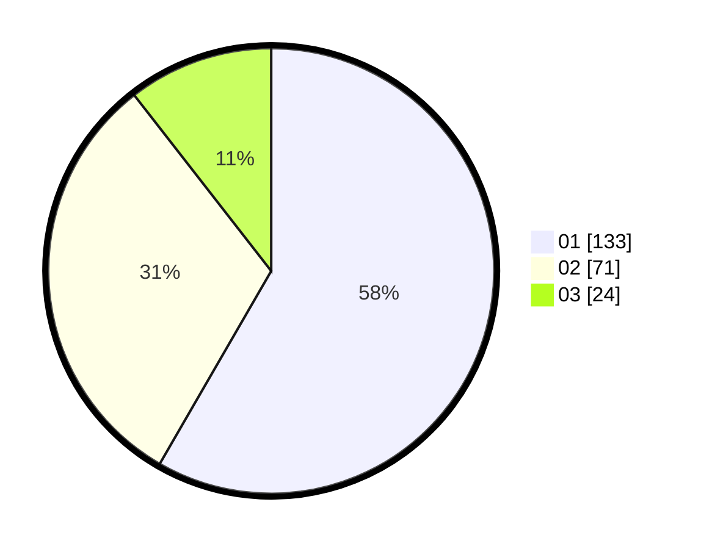

# Hasil

Hasil perolehan suara paslon dapat dilihat pada file paslon-01.txt, paslon-02.txt, dan paslon-03.txt.

Jika tidak ada, artinya data tersebut belum ada pada SIREKAP.

## Perolehan Suara

 * Paslon 01: **133**.
 * Paslon 02: **71**.
 * Paslon 03: **24**.

## Foto C Plano

https://sirekap-obj-formc.kpu.go.id/3ccc/pemilu/ppwp/31/75/07/10/05/3175071005024-20240214-224548--881062fa-6ff9-45ba-9e44-ea113091ba3b.jpg

https://sirekap-obj-formc.kpu.go.id/3ccc/pemilu/ppwp/31/75/07/10/05/3175071005024-20240214-224650--6e83ba5a-854b-497d-af16-9b54d4d24f85.jpg

https://sirekap-obj-formc.kpu.go.id/3ccc/pemilu/ppwp/31/75/07/10/05/3175071005024-20240214-224812--3bd621bd-e481-48eb-88d2-2b1a5b8dae6d.jpg
