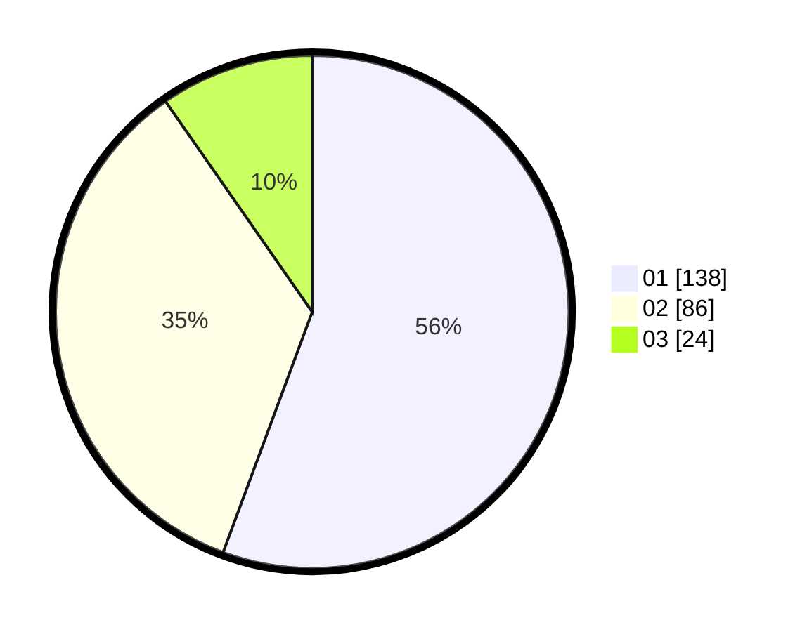

# Hasil

Hasil perolehan suara paslon dapat dilihat pada file paslon-01.txt, paslon-02.txt, dan paslon-03.txt.

Jika tidak ada, artinya data tersebut belum ada pada SIREKAP.

## Perolehan Suara

 * Paslon 01: **138**.
 * Paslon 02: **86**.
 * Paslon 03: **24**.

## Foto C Plano

https://sirekap-obj-formc.kpu.go.id/05ad/pemilu/ppwp/31/75/07/10/05/3175071005026-20240214-204719--3e96b42b-0402-4c0a-bb1a-bf378dd08070.jpg

https://sirekap-obj-formc.kpu.go.id/05ad/pemilu/ppwp/31/75/07/10/05/3175071005026-20240214-204326--a8e6d125-5b51-4bf8-873e-78b9c2e0e935.jpg

https://sirekap-obj-formc.kpu.go.id/05ad/pemilu/ppwp/31/75/07/10/05/3175071005026-20240214-204546--9db061e7-691e-492e-869e-da74ca68bd96.jpg

## DATA PEMILIH TETAP

Jumlah pemilih dalam DPT: **294**.
 * L: **131**.
 * P: **163**.

## DATA PENGGUNA HAK PILIH

Jumlah pengguna hak pilih dalam DPT: **247**.
 * L: **109**.
 * P: **138**.

Jumlah pengguna hak pilih dalam DPTb: **0**.
 * L: **0**.
 * P: **0**.

Jumlah pengguna hak pilih dalam DPK: **2**.
 * L: **1**.
 * P: **1**.

Jumlah pengguna hak pilih: **249**.
 * L: **110**.
 * P: **139**.

## JUMLAH SUARA SAH DAN TIDAK SAH

JUMLAH SELURUH SUARA SAH: **248**.

JUMLAH SUARA TIDAK SAH: **1**.

JUMLAH SELURUH SUARA SAH DAN SUARA TIDAK SAH: **249**.
