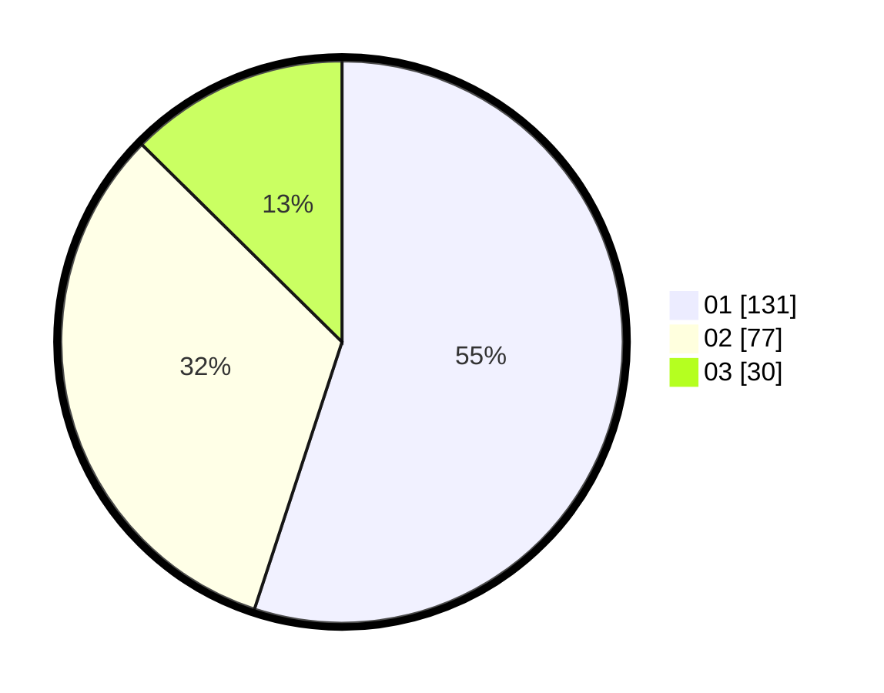

# Hasil

Hasil perolehan suara paslon dapat dilihat pada file paslon-01.txt, paslon-02.txt, dan paslon-03.txt.

Jika tidak ada, artinya data tersebut belum ada pada SIREKAP.

## Perolehan Suara

 * Paslon 01: **131**.
 * Paslon 02: **77**.
 * Paslon 03: **30**.

## Foto C Plano

https://sirekap-obj-formc.kpu.go.id/803d/pemilu/ppwp/31/75/07/10/05/3175071005035-20240214-155245--ae035624-cf54-4723-98b9-0c2353173c97.jpg

https://sirekap-obj-formc.kpu.go.id/803d/pemilu/ppwp/31/75/07/10/05/3175071005035-20240214-215738--43bad1b4-9bb4-48cb-8493-eb0c489ccd9b.jpg

https://sirekap-obj-formc.kpu.go.id/803d/pemilu/ppwp/31/75/07/10/05/3175071005035-20240214-215824--8b77b8e2-0785-41ac-8fca-3048ea1d6540.jpg
