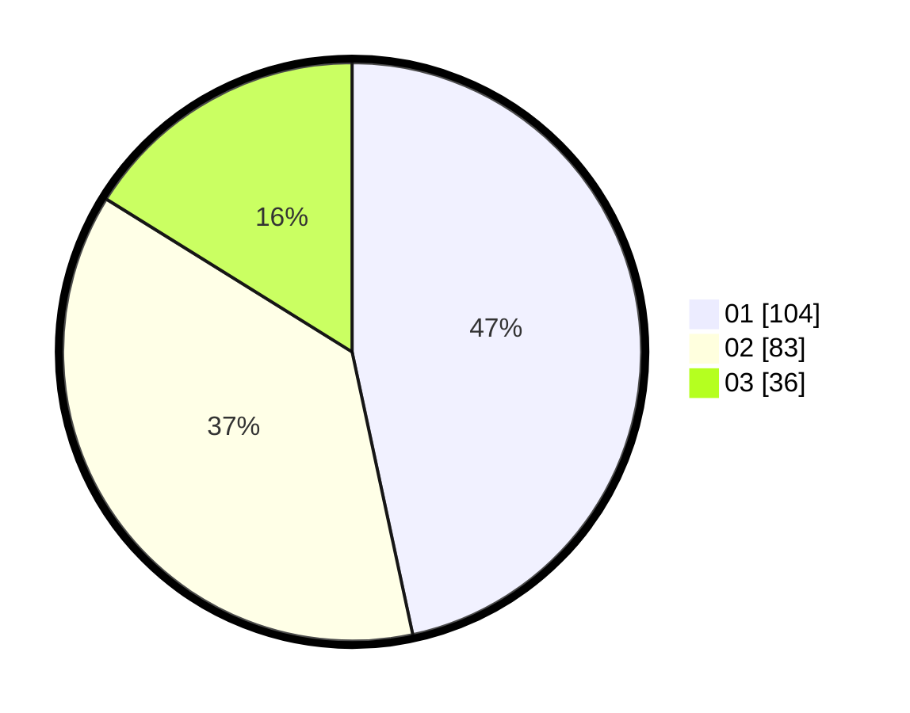

# Hasil

Hasil perolehan suara paslon dapat dilihat pada file paslon-01.txt, paslon-02.txt, dan paslon-03.txt.

Jika tidak ada, artinya data tersebut belum ada pada SIREKAP.

## Perolehan Suara

 * Paslon 01: **104**.
 * Paslon 02: **83**.
 * Paslon 03: **36**.

## Foto C Plano

https://sirekap-obj-formc.kpu.go.id/7e94/pemilu/ppwp/31/75/07/10/05/3175071005051-20240214-202206--eabc1f09-0710-40f2-a315-a6f898ff5fa8.jpg

https://sirekap-obj-formc.kpu.go.id/7e94/pemilu/ppwp/31/75/07/10/05/3175071005051-20240214-202237--1a80fa27-23d7-4697-8373-99fbc70bab0a.jpg

https://sirekap-obj-formc.kpu.go.id/7e94/pemilu/ppwp/31/75/07/10/05/3175071005051-20240214-202537--4a83b7a6-77a4-4771-9ecd-0b723ef8c6cd.jpg

## DATA PEMILIH TETAP

Jumlah pemilih dalam DPT: **273**.
 * L: **120**.
 * P: **153**.

## DATA PENGGUNA HAK PILIH

Jumlah pengguna hak pilih dalam DPT: **219**.
 * L: **100**.
 * P: **119**.

Jumlah pengguna hak pilih dalam DPTb: **7**.
 * L: **2**.
 * P: **5**.

Jumlah pengguna hak pilih dalam DPK: **5**.
 * L: **2**.
 * P: **3**.

Jumlah pengguna hak pilih: **231**.
 * L: **104**.
 * P: **127**.

## JUMLAH SUARA SAH DAN TIDAK SAH

JUMLAH SELURUH SUARA SAH: **223**.

JUMLAH SUARA TIDAK SAH: **8**.

JUMLAH SELURUH SUARA SAH DAN SUARA TIDAK SAH: **231**.
