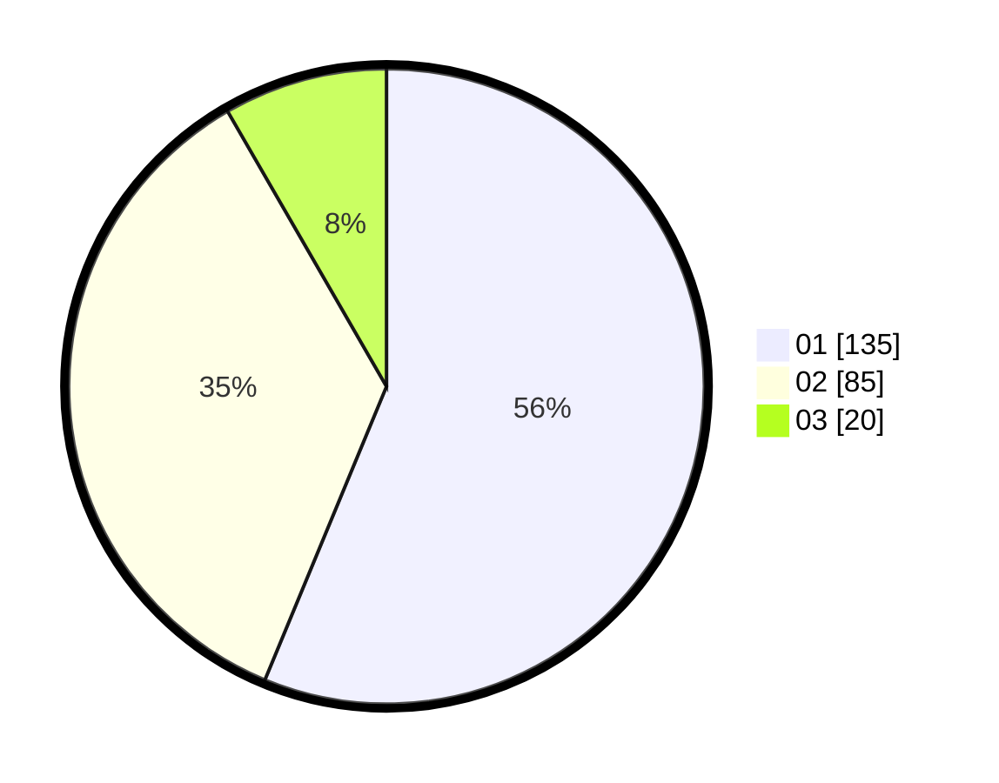

# Hasil

Hasil perolehan suara paslon dapat dilihat pada file paslon-01.txt, paslon-02.txt, dan paslon-03.txt.

Jika tidak ada, artinya data tersebut belum ada pada SIREKAP.

## Perolehan Suara

 * Paslon 01: **135**.
 * Paslon 02: **85**.
 * Paslon 03: **20**.

## Foto C Plano

https://sirekap-obj-formc.kpu.go.id/d9ac/pemilu/ppwp/31/75/07/10/05/3175071005062-20240214-155540--70d6c3dd-91cb-4ea2-bbbd-f3b9bc6731fb.jpg

https://sirekap-obj-formc.kpu.go.id/d9ac/pemilu/ppwp/31/75/07/10/05/3175071005062-20240214-155546--c6dae01d-c514-4d7b-a736-9f2f03adf89d.jpg

https://sirekap-obj-formc.kpu.go.id/d9ac/pemilu/ppwp/31/75/07/10/05/3175071005062-20240214-155555--5ea7ad09-daf9-4b8c-943b-c0040421892e.jpg
