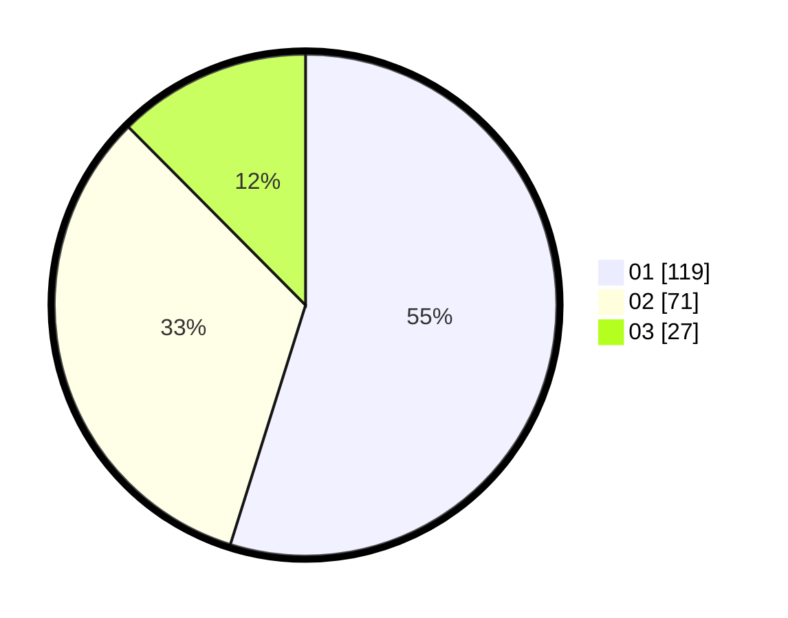

# Hasil

Hasil perolehan suara paslon dapat dilihat pada file paslon-01.txt, paslon-02.txt, dan paslon-03.txt.

Jika tidak ada, artinya data tersebut belum ada pada SIREKAP.

## Perolehan Suara

 * Paslon 01: **119**.
 * Paslon 02: **71**.
 * Paslon 03: **27**.

## Foto C Plano

https://sirekap-obj-formc.kpu.go.id/23d0/pemilu/ppwp/31/75/07/10/05/3175071005067-20240216-005328--3ff5ed1c-42e2-4f0b-9d5b-52263871753e.jpg

https://sirekap-obj-formc.kpu.go.id/23d0/pemilu/ppwp/31/75/07/10/05/3175071005067-20240216-005331--8c7fce5b-9055-46e0-979a-428d9a73a5f8.jpg

https://sirekap-obj-formc.kpu.go.id/23d0/pemilu/ppwp/31/75/07/10/05/3175071005067-20240216-005330--8d24aec9-a497-4c04-ba97-4885b5d3c67c.jpg

## DATA PEMILIH TETAP

Jumlah pemilih dalam DPT: **268**.
 * L: **125**.
 * P: **143**.

## DATA PENGGUNA HAK PILIH

Jumlah pengguna hak pilih dalam DPT: **216**.
 * L: **102**.
 * P: **114**.

Jumlah pengguna hak pilih dalam DPTb: **1**.
 * L: **0**.
 * P: **1**.

Jumlah pengguna hak pilih dalam DPK: **3**.
 * L: **2**.
 * P: **1**.

Jumlah pengguna hak pilih: **220**.
 * L: **104**.
 * P: **116**.

## JUMLAH SUARA SAH DAN TIDAK SAH

JUMLAH SELURUH SUARA SAH: **217**.

JUMLAH SUARA TIDAK SAH: **3**.

JUMLAH SELURUH SUARA SAH DAN SUARA TIDAK SAH: **220**.
