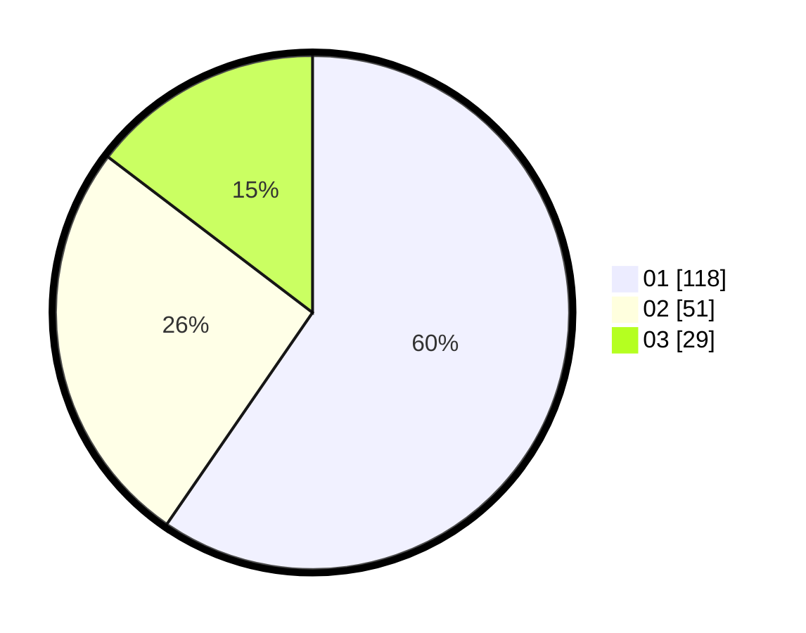

# Hasil

Hasil perolehan suara paslon dapat dilihat pada file paslon-01.txt, paslon-02.txt, dan paslon-03.txt.

Jika tidak ada, artinya data tersebut belum ada pada SIREKAP.

## Perolehan Suara

 * Paslon 01: **118**.
 * Paslon 02: **51**.
 * Paslon 03: **29**.

## Foto C Plano

https://sirekap-obj-formc.kpu.go.id/83eb/pemilu/ppwp/31/75/07/10/05/3175071005071-20240214-211358--fffc98f9-7750-4c2a-918e-4ecf9d267d0b.jpg

https://sirekap-obj-formc.kpu.go.id/83eb/pemilu/ppwp/31/75/07/10/05/3175071005071-20240214-211549--99a2ce9a-5528-4fee-9a9e-dd300c0a84c6.jpg

https://sirekap-obj-formc.kpu.go.id/83eb/pemilu/ppwp/31/75/07/10/05/3175071005071-20240214-211747--9901aeca-ae19-4a01-9a85-165bd8985e75.jpg
