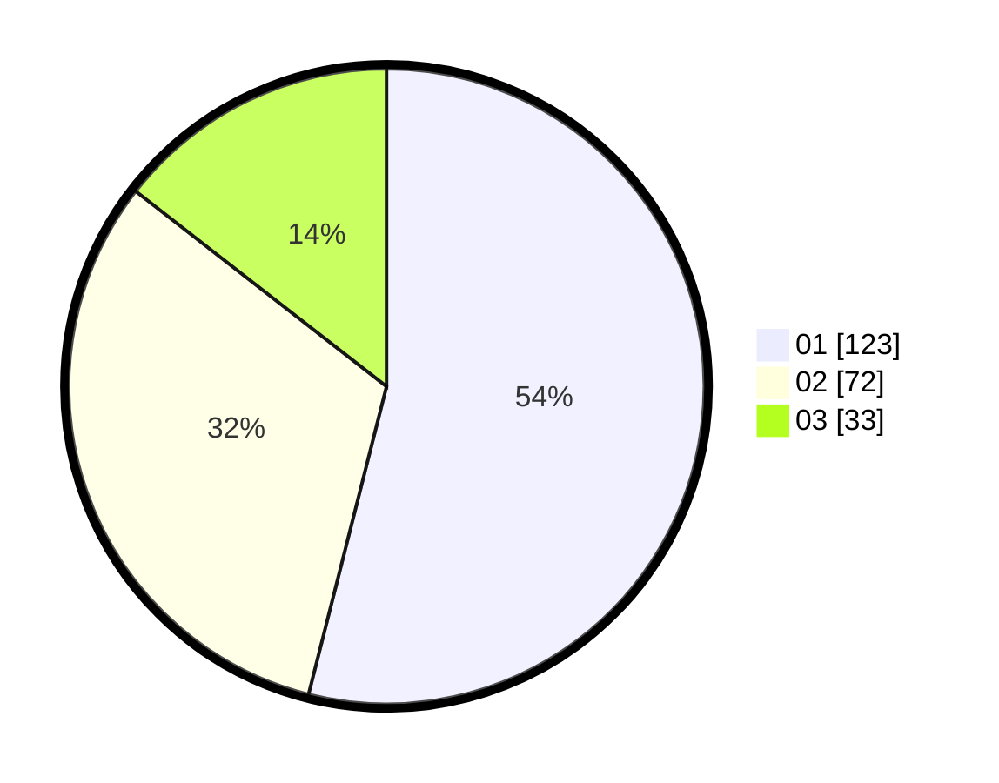

# Hasil

Hasil perolehan suara paslon dapat dilihat pada file paslon-01.txt, paslon-02.txt, dan paslon-03.txt.

Jika tidak ada, artinya data tersebut belum ada pada SIREKAP.

## Perolehan Suara

 * Paslon 01: **123**.
 * Paslon 02: **72**.
 * Paslon 03: **33**.

## Foto C Plano

https://sirekap-obj-formc.kpu.go.id/7c68/pemilu/ppwp/31/75/07/10/05/3175071005074-20240214-224557--6475201d-962f-4a2f-a7ac-98241a5d4962.jpg

https://sirekap-obj-formc.kpu.go.id/7c68/pemilu/ppwp/31/75/07/10/05/3175071005074-20240214-224718--473356db-9e49-4bfc-95c2-218547804032.jpg

https://sirekap-obj-formc.kpu.go.id/7c68/pemilu/ppwp/31/75/07/10/05/3175071005074-20240214-224446--b2566fe8-f7a7-4bbc-b26d-96ba08477a33.jpg
