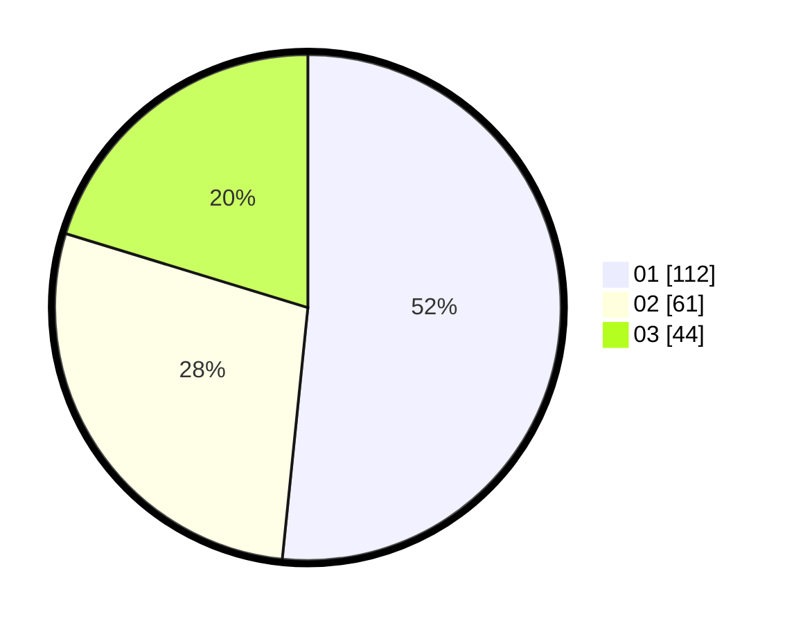

# Hasil

Hasil perolehan suara paslon dapat dilihat pada file paslon-01.txt, paslon-02.txt, dan paslon-03.txt.

Jika tidak ada, artinya data tersebut belum ada pada SIREKAP.

## Perolehan Suara

 * Paslon 01: **112**.
 * Paslon 02: **61**.
 * Paslon 03: **44**.

## Foto C Plano

https://sirekap-obj-formc.kpu.go.id/33b3/pemilu/ppwp/31/75/07/10/05/3175071005076-20240216-140344--08969dd7-3d4f-4959-8ed6-3ed569456ca3.jpg

https://sirekap-obj-formc.kpu.go.id/33b3/pemilu/ppwp/31/75/07/10/05/3175071005076-20240216-140346--d4cbbec4-2df7-4f2d-b997-80fa9fecc589.jpg

https://sirekap-obj-formc.kpu.go.id/33b3/pemilu/ppwp/31/75/07/10/05/3175071005076-20240216-140345--e1c78b03-ef59-4f1f-bb67-5faa935eec13.jpg

## DATA PEMILIH TETAP

Jumlah pemilih dalam DPT: **278**.
 * L: **134**.
 * P: **144**.

## DATA PENGGUNA HAK PILIH

Jumlah pengguna hak pilih dalam DPT: **217**.
 * L: **102**.
 * P: **115**.

Jumlah pengguna hak pilih dalam DPTb: **0**.
 * L: **0**.
 * P: **0**.

Jumlah pengguna hak pilih dalam DPK: **2**.
 * L: **1**.
 * P: **1**.

Jumlah pengguna hak pilih: **219**.
 * L: **103**.
 * P: **116**.

## JUMLAH SUARA SAH DAN TIDAK SAH

JUMLAH SELURUH SUARA SAH: **217**.

JUMLAH SUARA TIDAK SAH: **2**.

JUMLAH SELURUH SUARA SAH DAN SUARA TIDAK SAH: **219**.
