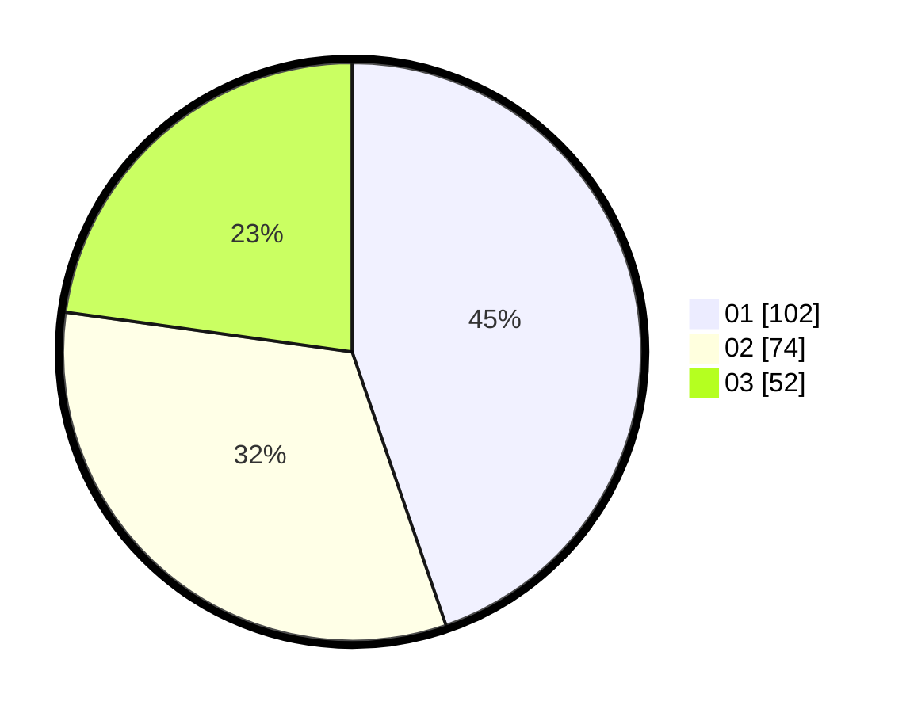

# Hasil

Hasil perolehan suara paslon dapat dilihat pada file paslon-01.txt, paslon-02.txt, dan paslon-03.txt.

Jika tidak ada, artinya data tersebut belum ada pada SIREKAP.

## Perolehan Suara

 * Paslon 01: **102**.
 * Paslon 02: **74**.
 * Paslon 03: **52**.

## Foto C Plano

https://sirekap-obj-formc.kpu.go.id/4e8d/pemilu/ppwp/31/75/07/10/05/3175071005078-20240214-213919--6e2d10ad-d052-40e9-8e0f-213105d859f8.jpg

https://sirekap-obj-formc.kpu.go.id/4e8d/pemilu/ppwp/31/75/07/10/05/3175071005078-20240214-214028--0750631f-f813-4902-b5a1-345f32398f31.jpg

https://sirekap-obj-formc.kpu.go.id/4e8d/pemilu/ppwp/31/75/07/10/05/3175071005078-20240214-214108--4120534c-4a05-43cd-bfec-47013f607790.jpg
