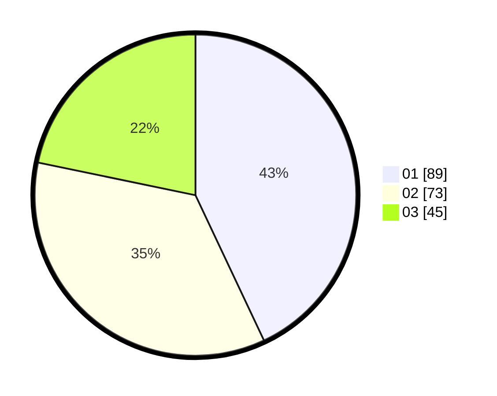

# Hasil

Hasil perolehan suara paslon dapat dilihat pada file paslon-01.txt, paslon-02.txt, dan paslon-03.txt.

Jika tidak ada, artinya data tersebut belum ada pada SIREKAP.

## Perolehan Suara

 * Paslon 01: **89**.
 * Paslon 02: **73**.
 * Paslon 03: **45**.

## Foto C Plano

https://sirekap-obj-formc.kpu.go.id/8f20/pemilu/ppwp/31/75/07/10/06/3175071006006-20240215-215219--221cfe17-d8eb-4fe5-bbef-76af453396b9.jpg

https://sirekap-obj-formc.kpu.go.id/8f20/pemilu/ppwp/31/75/07/10/06/3175071006006-20240215-215223--1b7284a3-af9a-46df-b0b6-7c6a613877be.jpg

https://sirekap-obj-formc.kpu.go.id/8f20/pemilu/ppwp/31/75/07/10/06/3175071006006-20240215-215221--8abe0a2b-a8ca-4dc0-91c3-bf485539496f.jpg

## DATA PEMILIH TETAP

Jumlah pemilih dalam DPT: **270**.
 * L: **136**.
 * P: **134**.

## DATA PENGGUNA HAK PILIH

Jumlah pengguna hak pilih dalam DPT: **208**.
 * L: **100**.
 * P: **108**.

Jumlah pengguna hak pilih dalam DPTb: **0**.
 * L: **0**.
 * P: **0**.

Jumlah pengguna hak pilih dalam DPK: **0**.
 * L: **0**.
 * P: **0**.

Jumlah pengguna hak pilih: **208**.
 * L: **100**.
 * P: **108**.

## JUMLAH SUARA SAH DAN TIDAK SAH

JUMLAH SELURUH SUARA SAH: **207**.

JUMLAH SUARA TIDAK SAH: **1**.

JUMLAH SELURUH SUARA SAH DAN SUARA TIDAK SAH: **208**.
