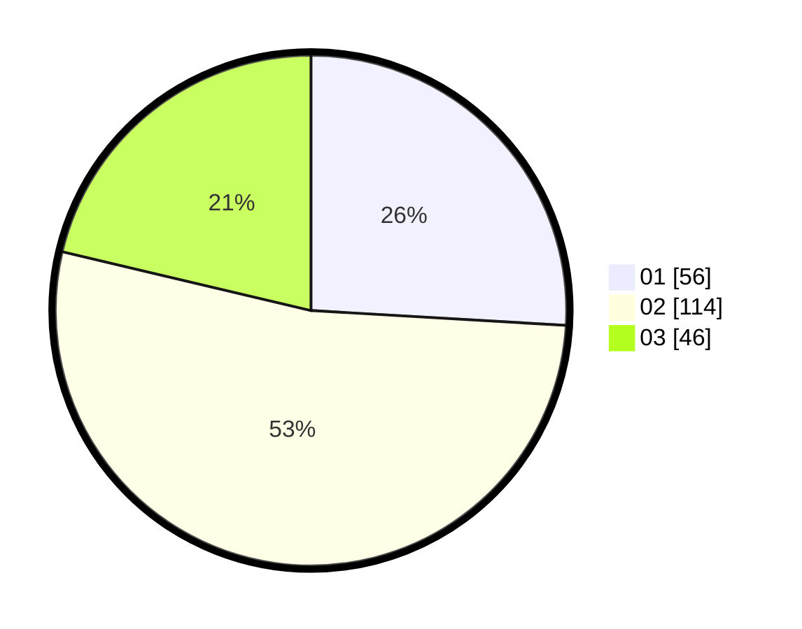

# Hasil

Hasil perolehan suara paslon dapat dilihat pada file paslon-01.txt, paslon-02.txt, dan paslon-03.txt.

Jika tidak ada, artinya data tersebut belum ada pada SIREKAP.

## Perolehan Suara

 * Paslon 01: **56**.
 * Paslon 02: **114**.
 * Paslon 03: **46**.

## Foto C Plano

https://sirekap-obj-formc.kpu.go.id/31cf/pemilu/ppwp/31/75/07/10/06/3175071006008-20240214-200559--9f44559a-873b-49fb-962c-73def0881e03.jpg

https://sirekap-obj-formc.kpu.go.id/31cf/pemilu/ppwp/31/75/07/10/06/3175071006008-20240214-200441--dcfe4902-a008-4dd8-bc44-f7bef8cd80d7.jpg

https://sirekap-obj-formc.kpu.go.id/31cf/pemilu/ppwp/31/75/07/10/06/3175071006008-20240214-200504--bfd6b125-4e15-40c8-92ba-6861e0901972.jpg
