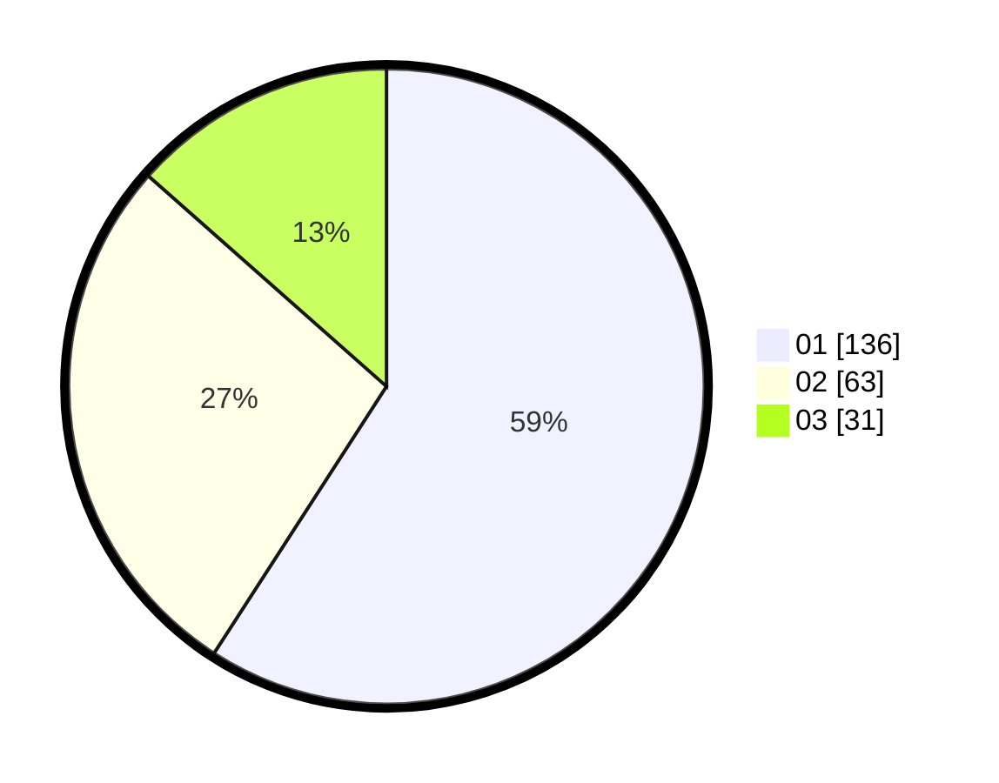

# Hasil

Hasil perolehan suara paslon dapat dilihat pada file paslon-01.txt, paslon-02.txt, dan paslon-03.txt.

Jika tidak ada, artinya data tersebut belum ada pada SIREKAP.

## Perolehan Suara

 * Paslon 01: **136**.
 * Paslon 02: **63**.
 * Paslon 03: **31**.

## Foto C Plano

https://sirekap-obj-formc.kpu.go.id/6837/pemilu/ppwp/31/75/07/10/06/3175071006009-20240214-194521--82c43cc3-6fc2-4b19-b438-19a89f470df1.jpg

https://sirekap-obj-formc.kpu.go.id/6837/pemilu/ppwp/31/75/07/10/06/3175071006009-20240214-194616--0a42d577-cf64-497c-aad1-c4cbd9eb9b4c.jpg

https://sirekap-obj-formc.kpu.go.id/6837/pemilu/ppwp/31/75/07/10/06/3175071006009-20240214-190420--ac81542e-348f-4199-9ca8-3c64497b3a39.jpg

## DATA PEMILIH TETAP

Jumlah pemilih dalam DPT: **270**.
 * L: **125**.
 * P: **145**.

## DATA PENGGUNA HAK PILIH

Jumlah pengguna hak pilih dalam DPT: **227**.
 * L: **109**.
 * P: **118**.

Jumlah pengguna hak pilih dalam DPTb: **0**.
 * L: **0**.
 * P: **0**.

Jumlah pengguna hak pilih dalam DPK: **8**.
 * L: **4**.
 * P: **4**.

Jumlah pengguna hak pilih: **235**.
 * L: **113**.
 * P: **122**.

## JUMLAH SUARA SAH DAN TIDAK SAH

JUMLAH SELURUH SUARA SAH: **230**.

JUMLAH SUARA TIDAK SAH: **5**.

JUMLAH SELURUH SUARA SAH DAN SUARA TIDAK SAH: **235**.
