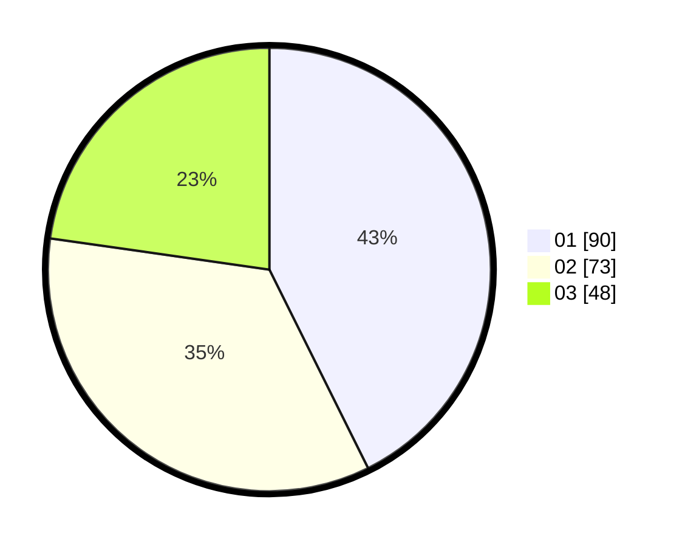

# Hasil

Hasil perolehan suara paslon dapat dilihat pada file paslon-01.txt, paslon-02.txt, dan paslon-03.txt.

Jika tidak ada, artinya data tersebut belum ada pada SIREKAP.

## Perolehan Suara

 * Paslon 01: **90**.
 * Paslon 02: **73**.
 * Paslon 03: **48**.

## Foto C Plano

https://sirekap-obj-formc.kpu.go.id/c8b9/pemilu/ppwp/31/75/07/10/06/3175071006013-20240214-192638--9c281101-245f-4949-9a06-f5bb74da3929.jpg

https://sirekap-obj-formc.kpu.go.id/c8b9/pemilu/ppwp/31/75/07/10/06/3175071006013-20240214-193030--99dfcfa4-af06-4534-91c7-5e0aab07ac17.jpg

https://sirekap-obj-formc.kpu.go.id/c8b9/pemilu/ppwp/31/75/07/10/06/3175071006013-20240214-194507--7f32393e-bbfa-4600-8d12-6b63b0f3aa1d.jpg

## DATA PEMILIH TETAP

Jumlah pemilih dalam DPT: **267**.
 * L: **127**.
 * P: **140**.

## DATA PENGGUNA HAK PILIH

Jumlah pengguna hak pilih dalam DPT: **211**.
 * L: **98**.
 * P: **113**.

Jumlah pengguna hak pilih dalam DPTb: **1**.
 * L: **1**.
 * P: **0**.

Jumlah pengguna hak pilih dalam DPK: **3**.
 * L: **1**.
 * P: **2**.

Jumlah pengguna hak pilih: **215**.
 * L: **100**.
 * P: **115**.

## JUMLAH SUARA SAH DAN TIDAK SAH

JUMLAH SELURUH SUARA SAH: **211**.

JUMLAH SUARA TIDAK SAH: **4**.

JUMLAH SELURUH SUARA SAH DAN SUARA TIDAK SAH: **215**.
