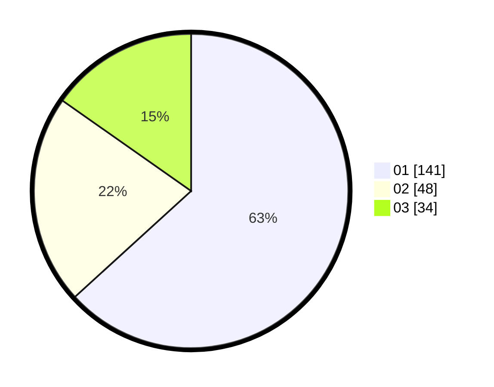

# Hasil

Hasil perolehan suara paslon dapat dilihat pada file paslon-01.txt, paslon-02.txt, dan paslon-03.txt.

Jika tidak ada, artinya data tersebut belum ada pada SIREKAP.

## Perolehan Suara

 * Paslon 01: **141**.
 * Paslon 02: **48**.
 * Paslon 03: **34**.

## Foto C Plano

https://sirekap-obj-formc.kpu.go.id/0bf5/pemilu/ppwp/31/75/07/10/06/3175071006022-20240214-202246--2b449f16-d1cd-41b6-bba7-9c93fe3b3450.jpg

https://sirekap-obj-formc.kpu.go.id/0bf5/pemilu/ppwp/31/75/07/10/06/3175071006022-20240214-202303--4da54460-003a-4d30-a7fb-80ca2b02fae3.jpg

https://sirekap-obj-formc.kpu.go.id/0bf5/pemilu/ppwp/31/75/07/10/06/3175071006022-20240214-202311--93de182c-02c9-4e45-b270-e566c268c553.jpg

## DATA PEMILIH TETAP

Jumlah pemilih dalam DPT: **259**.
 * L: **123**.
 * P: **136**.

## DATA PENGGUNA HAK PILIH

Jumlah pengguna hak pilih dalam DPT: **223**.
 * L: **100**.
 * P: **123**.

Jumlah pengguna hak pilih dalam DPTb: **1**.
 * L: **1**.
 * P: **0**.

Jumlah pengguna hak pilih dalam DPK: **2**.
 * L: **0**.
 * P: **2**.

Jumlah pengguna hak pilih: **226**.
 * L: **101**.
 * P: **125**.

## JUMLAH SUARA SAH DAN TIDAK SAH

JUMLAH SELURUH SUARA SAH: **223**.

JUMLAH SUARA TIDAK SAH: **3**.

JUMLAH SELURUH SUARA SAH DAN SUARA TIDAK SAH: **226**.
