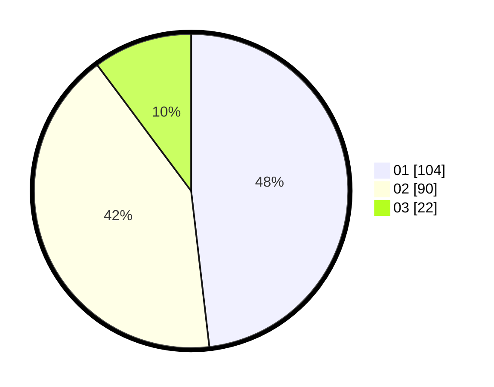

# Hasil

Hasil perolehan suara paslon dapat dilihat pada file paslon-01.txt, paslon-02.txt, dan paslon-03.txt.

Jika tidak ada, artinya data tersebut belum ada pada SIREKAP.

## Perolehan Suara

 * Paslon 01: **104**.
 * Paslon 02: **90**.
 * Paslon 03: **22**.

## Foto C Plano

https://sirekap-obj-formc.kpu.go.id/3b3b/pemilu/ppwp/31/75/07/10/06/3175071006026-20240214-155042--9c668b31-b282-472b-bcbd-6a2e1b8bb1c8.jpg

https://sirekap-obj-formc.kpu.go.id/3b3b/pemilu/ppwp/31/75/07/10/06/3175071006026-20240214-155136--51cf70ff-464a-46a9-b8d7-d0824f5a082c.jpg

https://sirekap-obj-formc.kpu.go.id/3b3b/pemilu/ppwp/31/75/07/10/06/3175071006026-20240214-155211--644da5f8-2383-4873-9cae-ae2a24b495e3.jpg

## DATA PEMILIH TETAP

Jumlah pemilih dalam DPT: **260**.
 * L: **127**.
 * P: **133**.

## DATA PENGGUNA HAK PILIH

Jumlah pengguna hak pilih dalam DPT: **216**.
 * L: **99**.
 * P: **117**.

Jumlah pengguna hak pilih dalam DPTb: **0**.
 * L: **0**.
 * P: **0**.

Jumlah pengguna hak pilih dalam DPK: **0**.
 * L: **0**.
 * P: **0**.

Jumlah pengguna hak pilih: **216**.
 * L: **99**.
 * P: **117**.

## JUMLAH SUARA SAH DAN TIDAK SAH

JUMLAH SELURUH SUARA SAH: **216**.

JUMLAH SUARA TIDAK SAH: **4**.

JUMLAH SELURUH SUARA SAH DAN SUARA TIDAK SAH: **220**.
