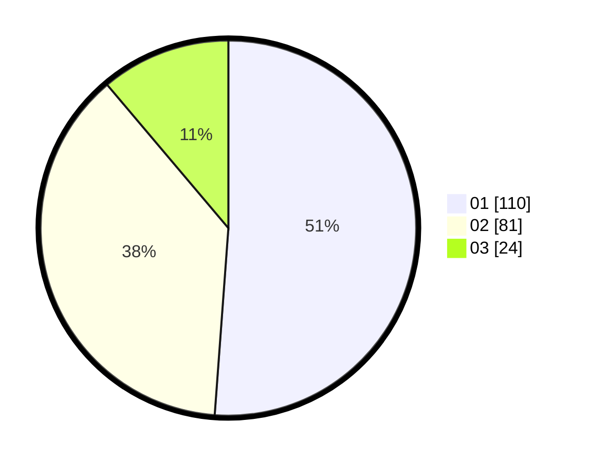

# Hasil

Hasil perolehan suara paslon dapat dilihat pada file paslon-01.txt, paslon-02.txt, dan paslon-03.txt.

Jika tidak ada, artinya data tersebut belum ada pada SIREKAP.

## Perolehan Suara

 * Paslon 01: **110**.
 * Paslon 02: **81**.
 * Paslon 03: **24**.

## Foto C Plano

https://sirekap-obj-formc.kpu.go.id/58e8/pemilu/ppwp/31/75/07/10/06/3175071006030-20240216-143048--c974df80-eab0-4d84-a465-af4b9fc55e41.jpg

https://sirekap-obj-formc.kpu.go.id/58e8/pemilu/ppwp/31/75/07/10/06/3175071006030-20240216-143049--33d73e86-31fe-4124-9f4d-c3a00467be5c.jpg

https://sirekap-obj-formc.kpu.go.id/58e8/pemilu/ppwp/31/75/07/10/06/3175071006030-20240216-143049--83728a53-5f85-471e-9b12-668e4d05e9f0.jpg

## DATA PEMILIH TETAP

Jumlah pemilih dalam DPT: **259**.
 * L: **126**.
 * P: **133**.

## DATA PENGGUNA HAK PILIH

Jumlah pengguna hak pilih dalam DPT: **209**.
 * L: **99**.
 * P: **110**.

Jumlah pengguna hak pilih dalam DPTb: **6**.
 * L: **2**.
 * P: **4**.

Jumlah pengguna hak pilih dalam DPK: **1**.
 * L: **0**.
 * P: **1**.

Jumlah pengguna hak pilih: **216**.
 * L: **101**.
 * P: **115**.

## JUMLAH SUARA SAH DAN TIDAK SAH

JUMLAH SELURUH SUARA SAH: **215**.

JUMLAH SUARA TIDAK SAH: **1**.

JUMLAH SELURUH SUARA SAH DAN SUARA TIDAK SAH: **216**.
