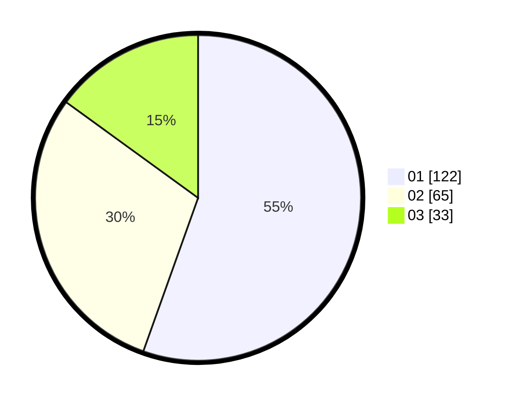

# Hasil

Hasil perolehan suara paslon dapat dilihat pada file paslon-01.txt, paslon-02.txt, dan paslon-03.txt.

Jika tidak ada, artinya data tersebut belum ada pada SIREKAP.

## Perolehan Suara

 * Paslon 01: **122**.
 * Paslon 02: **65**.
 * Paslon 03: **33**.

## Foto C Plano

https://sirekap-obj-formc.kpu.go.id/0f16/pemilu/ppwp/31/75/07/10/06/3175071006037-20240214-193359--c25595cb-ecba-4ba5-9678-1f47b50efcc5.jpg

https://sirekap-obj-formc.kpu.go.id/0f16/pemilu/ppwp/31/75/07/10/06/3175071006037-20240214-233833--c7d14ed8-cb75-49bb-a349-722c4ce6b07b.jpg

https://sirekap-obj-formc.kpu.go.id/0f16/pemilu/ppwp/31/75/07/10/06/3175071006037-20240214-194312--f24cc5b4-541a-4741-9a9d-4e941fafee15.jpg

## DATA PEMILIH TETAP

Jumlah pemilih dalam DPT: **268**.
 * L: **132**.
 * P: **136**.

## DATA PENGGUNA HAK PILIH

Jumlah pengguna hak pilih dalam DPT: **220**.
 * L: **100**.
 * P: **120**.

Jumlah pengguna hak pilih dalam DPTb: **0**.
 * L: **0**.
 * P: **0**.

Jumlah pengguna hak pilih dalam DPK: **0**.
 * L: **0**.
 * P: **0**.

Jumlah pengguna hak pilih: **220**.
 * L: **100**.
 * P: **120**.

## JUMLAH SUARA SAH DAN TIDAK SAH

JUMLAH SELURUH SUARA SAH: **220**.

JUMLAH SUARA TIDAK SAH: **0**.

JUMLAH SELURUH SUARA SAH DAN SUARA TIDAK SAH: **220**.
