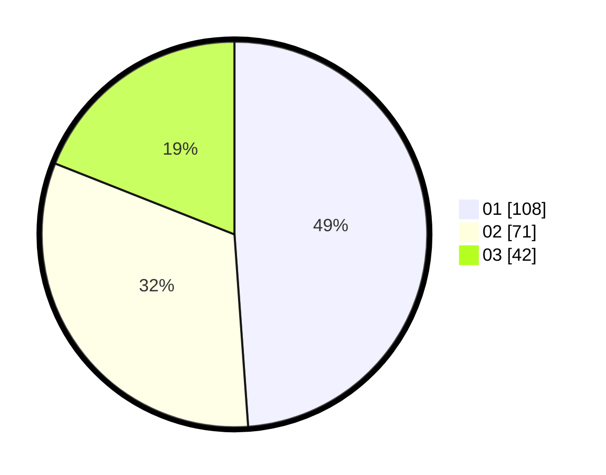

# Hasil

Hasil perolehan suara paslon dapat dilihat pada file paslon-01.txt, paslon-02.txt, dan paslon-03.txt.

Jika tidak ada, artinya data tersebut belum ada pada SIREKAP.

## Perolehan Suara

 * Paslon 01: **108**.
 * Paslon 02: **71**.
 * Paslon 03: **42**.

## Foto C Plano

https://sirekap-obj-formc.kpu.go.id/f0e9/pemilu/ppwp/31/75/07/10/06/3175071006038-20240216-151738--847aa7c2-85b4-4383-afbd-07c9ea4a25e4.jpg

https://sirekap-obj-formc.kpu.go.id/f0e9/pemilu/ppwp/31/75/07/10/06/3175071006038-20240216-151739--3f659d85-11ee-4675-90ed-df798bab9099.jpg

https://sirekap-obj-formc.kpu.go.id/f0e9/pemilu/ppwp/31/75/07/10/06/3175071006038-20240216-151739--29c433c8-ccdf-460a-9964-9196466ceeff.jpg

## DATA PEMILIH TETAP

Jumlah pemilih dalam DPT: **270**.
 * L: **126**.
 * P: **144**.

## DATA PENGGUNA HAK PILIH

Jumlah pengguna hak pilih dalam DPT: **214**.
 * L: **92**.
 * P: **122**.

Jumlah pengguna hak pilih dalam DPTb: **1**.
 * L: **0**.
 * P: **1**.

Jumlah pengguna hak pilih dalam DPK: **6**.
 * L: **5**.
 * P: **1**.

Jumlah pengguna hak pilih: **221**.
 * L: **97**.
 * P: **124**.

## JUMLAH SUARA SAH DAN TIDAK SAH

JUMLAH SELURUH SUARA SAH: **221**.

JUMLAH SUARA TIDAK SAH: **0**.

JUMLAH SELURUH SUARA SAH DAN SUARA TIDAK SAH: **221**.
