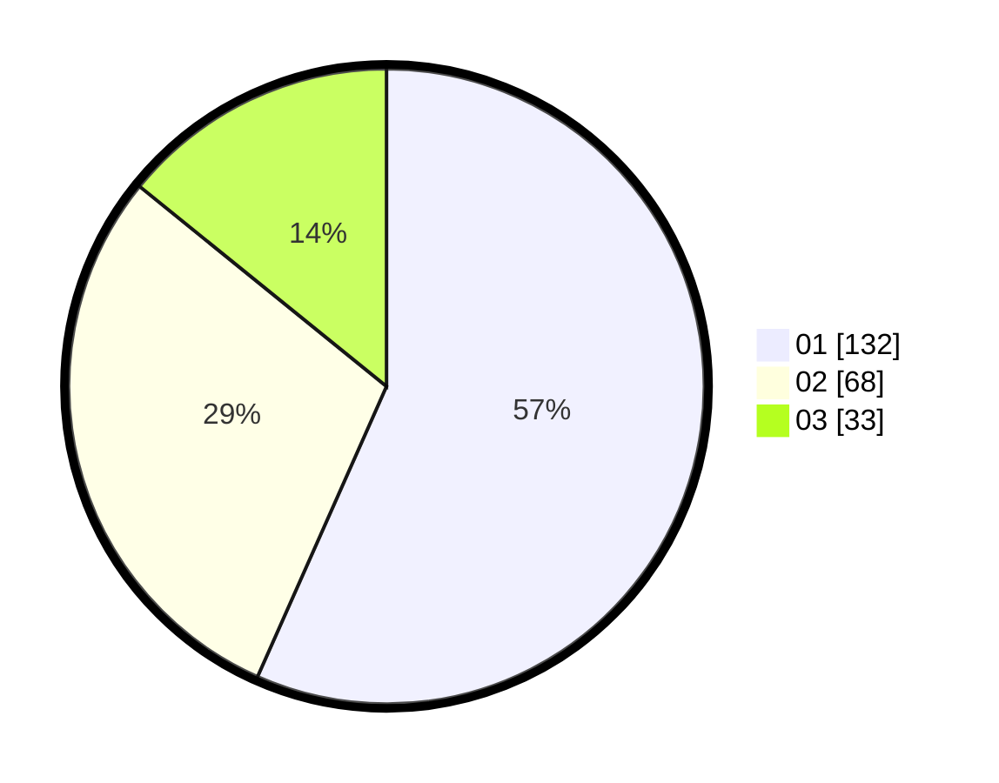

# Hasil

Hasil perolehan suara paslon dapat dilihat pada file paslon-01.txt, paslon-02.txt, dan paslon-03.txt.

Jika tidak ada, artinya data tersebut belum ada pada SIREKAP.

## Perolehan Suara

 * Paslon 01: **132**.
 * Paslon 02: **68**.
 * Paslon 03: **33**.

## Foto C Plano

https://sirekap-obj-formc.kpu.go.id/9785/pemilu/ppwp/31/75/07/10/06/3175071006044-20240216-190407--723027cd-6333-4df2-81db-112ec00aa90e.jpg

https://sirekap-obj-formc.kpu.go.id/9785/pemilu/ppwp/31/75/07/10/06/3175071006044-20240216-190408--d946d4ab-1760-4e4d-b183-50623261b564.jpg

https://sirekap-obj-formc.kpu.go.id/9785/pemilu/ppwp/31/75/07/10/06/3175071006044-20240216-190407--f5c4f0aa-d037-4a4d-9fa9-a2ac433900d4.jpg

## DATA PEMILIH TETAP

Jumlah pemilih dalam DPT: **284**.
 * L: **133**.
 * P: **151**.

## DATA PENGGUNA HAK PILIH

Jumlah pengguna hak pilih dalam DPT: **232**.
 * L: **107**.
 * P: **125**.

Jumlah pengguna hak pilih dalam DPTb: **3**.
 * L: **2**.
 * P: **1**.

Jumlah pengguna hak pilih dalam DPK: **0**.
 * L: **0**.
 * P: **0**.

Jumlah pengguna hak pilih: **235**.
 * L: **109**.
 * P: **126**.

## JUMLAH SUARA SAH DAN TIDAK SAH

JUMLAH SELURUH SUARA SAH: **233**.

JUMLAH SUARA TIDAK SAH: **2**.

JUMLAH SELURUH SUARA SAH DAN SUARA TIDAK SAH: **235**.
