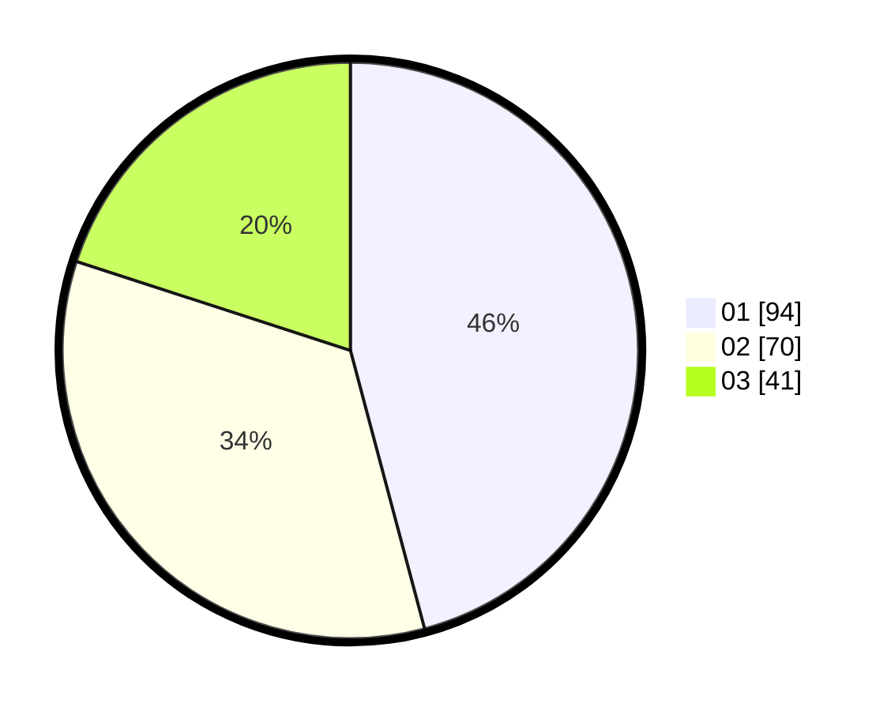

# Hasil

Hasil perolehan suara paslon dapat dilihat pada file paslon-01.txt, paslon-02.txt, dan paslon-03.txt.

Jika tidak ada, artinya data tersebut belum ada pada SIREKAP.

## Perolehan Suara

 * Paslon 01: **94**.
 * Paslon 02: **70**.
 * Paslon 03: **41**.

## Foto C Plano

https://sirekap-obj-formc.kpu.go.id/e779/pemilu/ppwp/31/75/07/10/06/3175071006045-20240214-155352--25e872bf-6e4a-4c87-bbd7-540307722b3e.jpg

https://sirekap-obj-formc.kpu.go.id/e779/pemilu/ppwp/31/75/07/10/06/3175071006045-20240214-155504--f48e8ef2-a54d-4460-9d2d-7d78930b4e79.jpg

https://sirekap-obj-formc.kpu.go.id/e779/pemilu/ppwp/31/75/07/10/06/3175071006045-20240214-155607--c65ea4d2-831e-49c9-a4d1-43d95b4ab631.jpg

## DATA PEMILIH TETAP

Jumlah pemilih dalam DPT: **208**.
 * L: **98**.
 * P: **110**.

## DATA PENGGUNA HAK PILIH

Jumlah pengguna hak pilih dalam DPT: **207**.
 * L: **98**.
 * P: **109**.

Jumlah pengguna hak pilih dalam DPTb: **0**.
 * L: **0**.
 * P: **0**.

Jumlah pengguna hak pilih dalam DPK: **1**.
 * L: **0**.
 * P: **1**.

Jumlah pengguna hak pilih: **208**.
 * L: **98**.
 * P: **110**.

## JUMLAH SUARA SAH DAN TIDAK SAH

JUMLAH SELURUH SUARA SAH: **205**.

JUMLAH SUARA TIDAK SAH: **3**.

JUMLAH SELURUH SUARA SAH DAN SUARA TIDAK SAH: **208**.
