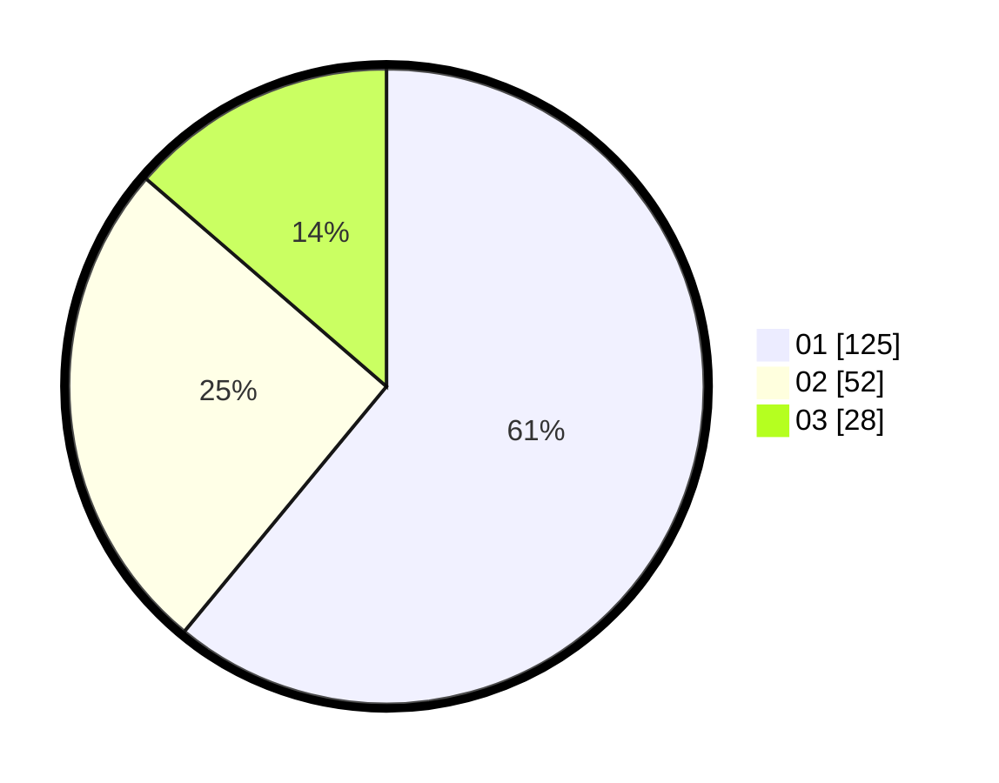

# Hasil

Hasil perolehan suara paslon dapat dilihat pada file paslon-01.txt, paslon-02.txt, dan paslon-03.txt.

Jika tidak ada, artinya data tersebut belum ada pada SIREKAP.

## Perolehan Suara

 * Paslon 01: **125**.
 * Paslon 02: **52**.
 * Paslon 03: **28**.

## Foto C Plano

https://sirekap-obj-formc.kpu.go.id/651a/pemilu/ppwp/31/75/07/10/06/3175071006050-20240215-123442--129282e2-dfb8-48a4-8144-76e65f65a166.jpg

https://sirekap-obj-formc.kpu.go.id/651a/pemilu/ppwp/31/75/07/10/06/3175071006050-20240215-123503--acd67e56-2523-4387-ad07-ec4c21e1869b.jpg

https://sirekap-obj-formc.kpu.go.id/651a/pemilu/ppwp/31/75/07/10/06/3175071006050-20240215-123452--56759856-ff6b-49a4-84aa-62624e5d3eba.jpg

## DATA PEMILIH TETAP

Jumlah pemilih dalam DPT: **257**.
 * L: **125**.
 * P: **132**.

## DATA PENGGUNA HAK PILIH

Jumlah pengguna hak pilih dalam DPT: **205**.
 * L: **99**.
 * P: **106**.

Jumlah pengguna hak pilih dalam DPTb: **1**.
 * L: **0**.
 * P: **1**.

Jumlah pengguna hak pilih dalam DPK: **0**.
 * L: **0**.
 * P: **0**.

Jumlah pengguna hak pilih: **206**.
 * L: **99**.
 * P: **107**.

## JUMLAH SUARA SAH DAN TIDAK SAH

JUMLAH SELURUH SUARA SAH: **205**.

JUMLAH SUARA TIDAK SAH: **1**.

JUMLAH SELURUH SUARA SAH DAN SUARA TIDAK SAH: **206**.
