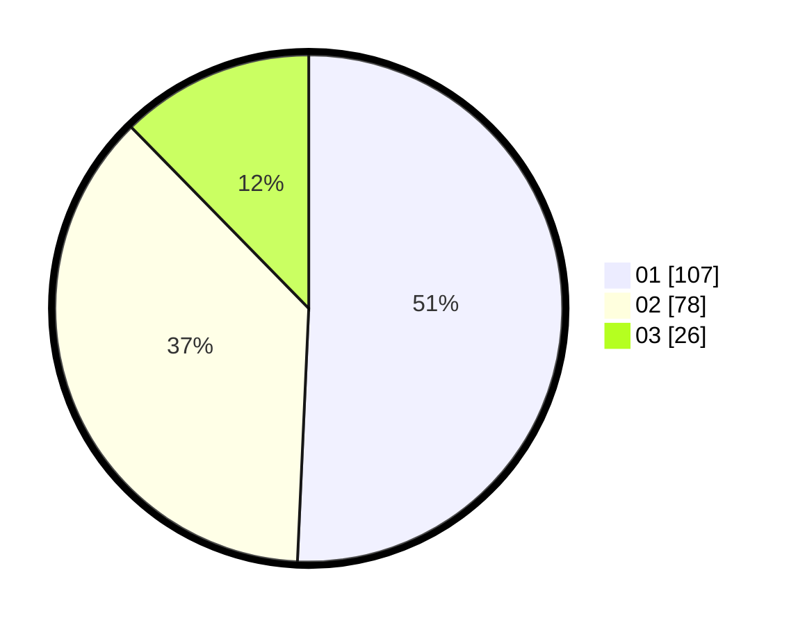

# Hasil

Hasil perolehan suara paslon dapat dilihat pada file paslon-01.txt, paslon-02.txt, dan paslon-03.txt.

Jika tidak ada, artinya data tersebut belum ada pada SIREKAP.

## Perolehan Suara

 * Paslon 01: **107**.
 * Paslon 02: **78**.
 * Paslon 03: **26**.

## Foto C Plano

https://sirekap-obj-formc.kpu.go.id/63a0/pemilu/ppwp/31/75/07/10/06/3175071006051-20240215-234328--46ae5dfa-b43f-4c62-bf59-2f46a6e04db3.jpg

https://sirekap-obj-formc.kpu.go.id/63a0/pemilu/ppwp/31/75/07/10/06/3175071006051-20240215-234329--923dc527-470f-462a-b742-db691d013997.jpg

https://sirekap-obj-formc.kpu.go.id/63a0/pemilu/ppwp/31/75/07/10/06/3175071006051-20240215-234328--b89a4fc5-9a3e-4fb8-a482-bce89b72b401.jpg

## DATA PEMILIH TETAP

Jumlah pemilih dalam DPT: **261**.
 * L: **125**.
 * P: **136**.

## DATA PENGGUNA HAK PILIH

Jumlah pengguna hak pilih dalam DPT: **208**.
 * L: **98**.
 * P: **110**.

Jumlah pengguna hak pilih dalam DPTb: **2**.
 * L: **1**.
 * P: **1**.

Jumlah pengguna hak pilih dalam DPK: **3**.
 * L: **0**.
 * P: **3**.

Jumlah pengguna hak pilih: **213**.
 * L: **99**.
 * P: **114**.

## JUMLAH SUARA SAH DAN TIDAK SAH

JUMLAH SELURUH SUARA SAH: **211**.

JUMLAH SUARA TIDAK SAH: **2**.

JUMLAH SELURUH SUARA SAH DAN SUARA TIDAK SAH: **213**.
