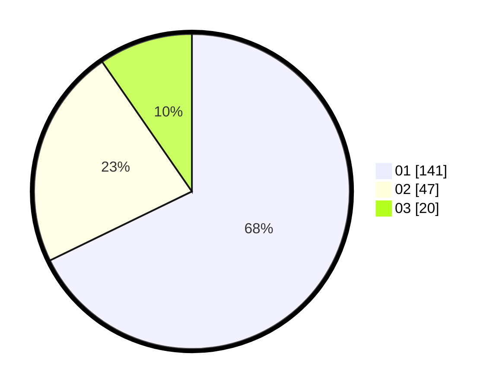

# Hasil

Hasil perolehan suara paslon dapat dilihat pada file paslon-01.txt, paslon-02.txt, dan paslon-03.txt.

Jika tidak ada, artinya data tersebut belum ada pada SIREKAP.

## Perolehan Suara

 * Paslon 01: **141**.
 * Paslon 02: **47**.
 * Paslon 03: **20**.

## Foto C Plano

https://sirekap-obj-formc.kpu.go.id/fb0f/pemilu/ppwp/31/75/07/10/06/3175071006053-20240215-232813--da285f10-bed6-4d98-943f-2b322bb7d134.jpg

https://sirekap-obj-formc.kpu.go.id/fb0f/pemilu/ppwp/31/75/07/10/06/3175071006053-20240215-232817--46e36aa0-8d3a-4ebe-8335-201b2fea2aea.jpg

https://sirekap-obj-formc.kpu.go.id/fb0f/pemilu/ppwp/31/75/07/10/06/3175071006053-20240215-232815--a0623b4d-e35b-4e8a-a37d-c54600f1010d.jpg

## DATA PEMILIH TETAP

Jumlah pemilih dalam DPT: **261**.
 * L: **129**.
 * P: **132**.

## DATA PENGGUNA HAK PILIH

Jumlah pengguna hak pilih dalam DPT: **212**.
 * L: **100**.
 * P: **112**.

Jumlah pengguna hak pilih dalam DPTb: **0**.
 * L: **0**.
 * P: **0**.

Jumlah pengguna hak pilih dalam DPK: **1**.
 * L: **1**.
 * P: **0**.

Jumlah pengguna hak pilih: **213**.
 * L: **101**.
 * P: **112**.

## JUMLAH SUARA SAH DAN TIDAK SAH

JUMLAH SELURUH SUARA SAH: **208**.

JUMLAH SUARA TIDAK SAH: **5**.

JUMLAH SELURUH SUARA SAH DAN SUARA TIDAK SAH: **213**.
