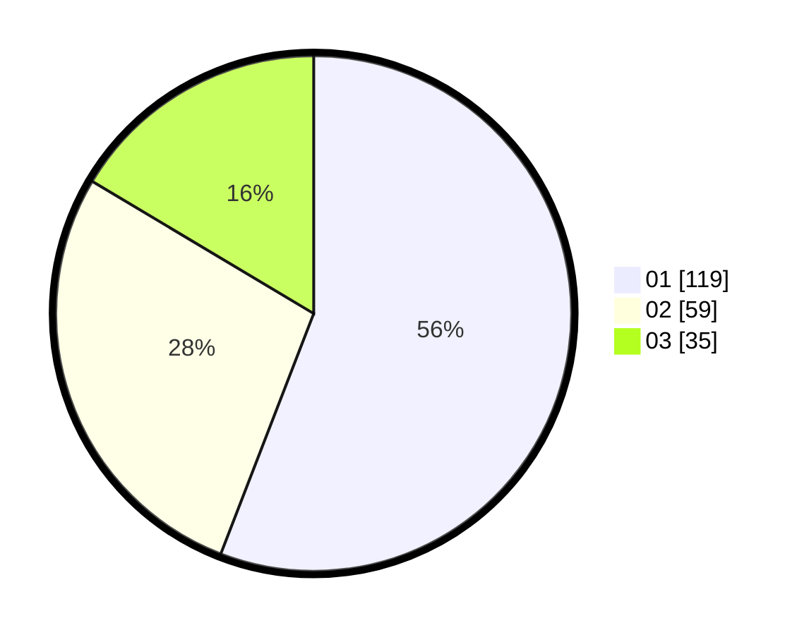

# Hasil

Hasil perolehan suara paslon dapat dilihat pada file paslon-01.txt, paslon-02.txt, dan paslon-03.txt.

Jika tidak ada, artinya data tersebut belum ada pada SIREKAP.

## Perolehan Suara

 * Paslon 01: **119**.
 * Paslon 02: **59**.
 * Paslon 03: **35**.

## Foto C Plano

https://sirekap-obj-formc.kpu.go.id/192d/pemilu/ppwp/31/75/07/10/06/3175071006055-20240214-155521--2d747d6a-647b-41c7-9f58-11cd1d4e5a79.jpg

https://sirekap-obj-formc.kpu.go.id/192d/pemilu/ppwp/31/75/07/10/06/3175071006055-20240214-205832--48266b1b-6181-46ce-ba71-988f49436673.jpg

https://sirekap-obj-formc.kpu.go.id/192d/pemilu/ppwp/31/75/07/10/06/3175071006055-20240214-211449--e9243668-87a1-426a-8b55-d4af52dae672.jpg

## DATA PEMILIH TETAP

Jumlah pemilih dalam DPT: **261**.
 * L: **125**.
 * P: **136**.

## DATA PENGGUNA HAK PILIH

Jumlah pengguna hak pilih dalam DPT: **214**.
 * L: **99**.
 * P: **115**.

Jumlah pengguna hak pilih dalam DPTb: **0**.
 * L: **0**.
 * P: **0**.

Jumlah pengguna hak pilih dalam DPK: **2**.
 * L: **1**.
 * P: **1**.

Jumlah pengguna hak pilih: **216**.
 * L: **100**.
 * P: **116**.

## JUMLAH SUARA SAH DAN TIDAK SAH

JUMLAH SELURUH SUARA SAH: **213**.

JUMLAH SUARA TIDAK SAH: **3**.

JUMLAH SELURUH SUARA SAH DAN SUARA TIDAK SAH: **216**.
