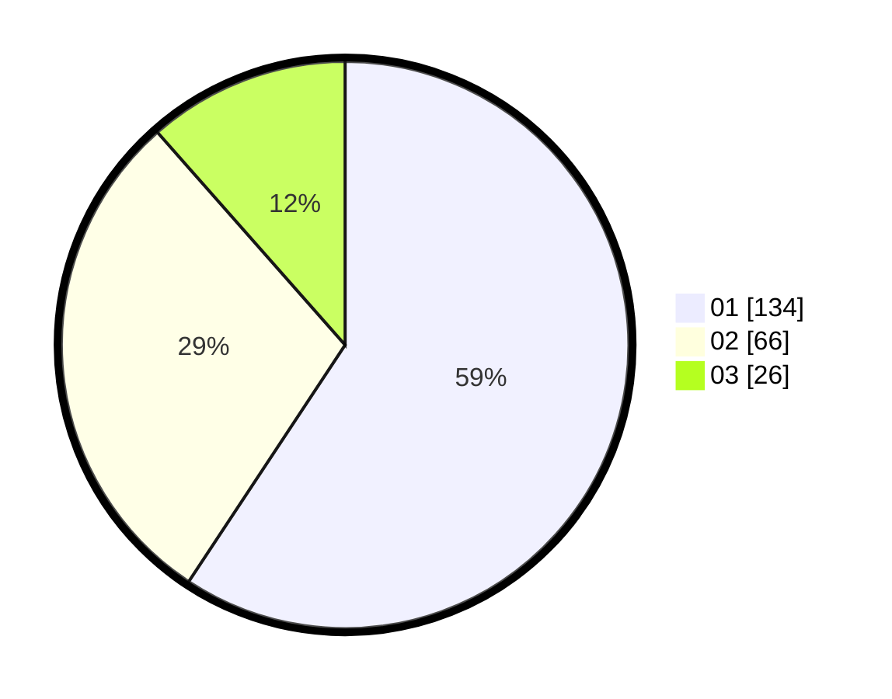

# Hasil

Hasil perolehan suara paslon dapat dilihat pada file paslon-01.txt, paslon-02.txt, dan paslon-03.txt.

Jika tidak ada, artinya data tersebut belum ada pada SIREKAP.

## Perolehan Suara

 * Paslon 01: **134**.
 * Paslon 02: **66**.
 * Paslon 03: **26**.

## Foto C Plano

https://sirekap-obj-formc.kpu.go.id/f80f/pemilu/ppwp/31/75/07/10/06/3175071006057-20240214-160141--010252e7-1d46-4396-ae98-fc3d6908b569.jpg

https://sirekap-obj-formc.kpu.go.id/f80f/pemilu/ppwp/31/75/07/10/06/3175071006057-20240214-195009--9b8fc6e3-ae01-43dd-bd4e-a7a754243579.jpg

https://sirekap-obj-formc.kpu.go.id/f80f/pemilu/ppwp/31/75/07/10/06/3175071006057-20240214-200810--6f0caef7-5361-4980-a5a0-7da7260b097a.jpg

## DATA PEMILIH TETAP

Jumlah pemilih dalam DPT: **279**.
 * L: **133**.
 * P: **145**.

## DATA PENGGUNA HAK PILIH

Jumlah pengguna hak pilih dalam DPT: **227**.
 * L: **106**.
 * P: **121**.

Jumlah pengguna hak pilih dalam DPTb: **0**.
 * L: **0**.
 * P: **0**.

Jumlah pengguna hak pilih dalam DPK: **1**.
 * L: **1**.
 * P: **0**.

Jumlah pengguna hak pilih: **228**.
 * L: **107**.
 * P: **121**.

## JUMLAH SUARA SAH DAN TIDAK SAH

JUMLAH SELURUH SUARA SAH: **226**.

JUMLAH SUARA TIDAK SAH: **2**.

JUMLAH SELURUH SUARA SAH DAN SUARA TIDAK SAH: **228**.
