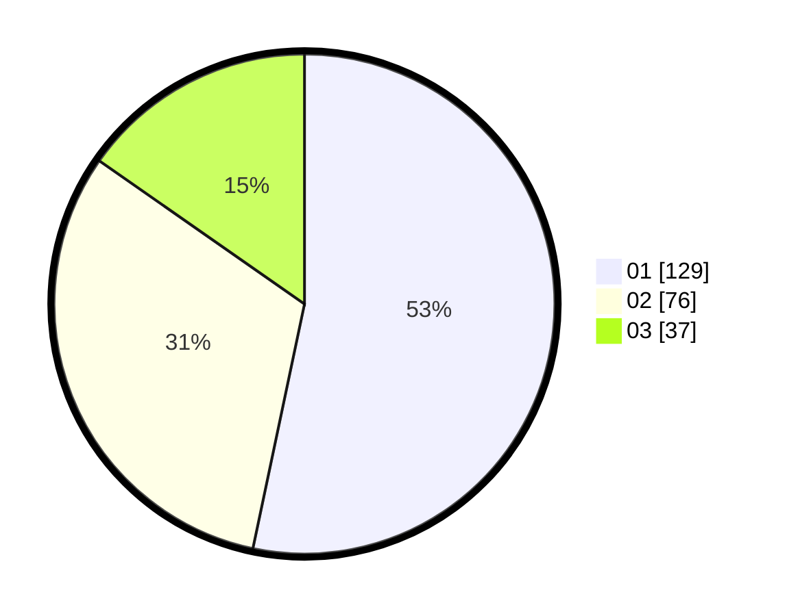

# Hasil

Hasil perolehan suara paslon dapat dilihat pada file paslon-01.txt, paslon-02.txt, dan paslon-03.txt.

Jika tidak ada, artinya data tersebut belum ada pada SIREKAP.

## Perolehan Suara

 * Paslon 01: **129**.
 * Paslon 02: **76**.
 * Paslon 03: **37**.

## Foto C Plano

https://sirekap-obj-formc.kpu.go.id/d6d8/pemilu/ppwp/31/75/07/10/06/3175071006059-20240215-215716--87ac6439-d068-49f9-ab56-a7f605e5938c.jpg

https://sirekap-obj-formc.kpu.go.id/d6d8/pemilu/ppwp/31/75/07/10/06/3175071006059-20240215-215717--04cad587-dd97-4a8e-8182-f38185e600f8.jpg

https://sirekap-obj-formc.kpu.go.id/d6d8/pemilu/ppwp/31/75/07/10/06/3175071006059-20240215-215717--f4d2fab1-8a13-436d-8678-794761844204.jpg

## DATA PEMILIH TETAP

Jumlah pemilih dalam DPT: **288**.
 * L: **133**.
 * P: **155**.

## DATA PENGGUNA HAK PILIH

Jumlah pengguna hak pilih dalam DPT: **243**.
 * L: **111**.
 * P: **132**.

Jumlah pengguna hak pilih dalam DPTb: **1**.
 * L: **0**.
 * P: **1**.

Jumlah pengguna hak pilih dalam DPK: **1**.
 * L: **1**.
 * P: **0**.

Jumlah pengguna hak pilih: **245**.
 * L: **112**.
 * P: **133**.

## JUMLAH SUARA SAH DAN TIDAK SAH

JUMLAH SELURUH SUARA SAH: **242**.

JUMLAH SUARA TIDAK SAH: **3**.

JUMLAH SELURUH SUARA SAH DAN SUARA TIDAK SAH: **245**.
