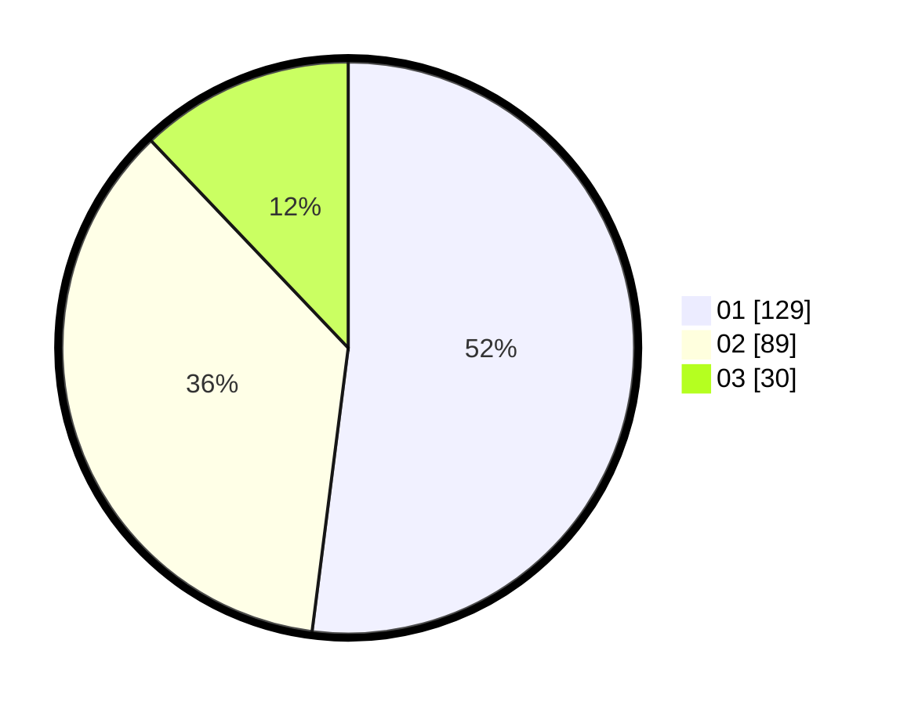

# Hasil

Hasil perolehan suara paslon dapat dilihat pada file paslon-01.txt, paslon-02.txt, dan paslon-03.txt.

Jika tidak ada, artinya data tersebut belum ada pada SIREKAP.

## Perolehan Suara

 * Paslon 01: **129**.
 * Paslon 02: **89**.
 * Paslon 03: **30**.

## Foto C Plano

https://sirekap-obj-formc.kpu.go.id/7ba5/pemilu/ppwp/31/75/07/10/06/3175071006061-20240214-185713--610d89c8-806b-4e17-a75c-75e34148bec1.jpg

https://sirekap-obj-formc.kpu.go.id/7ba5/pemilu/ppwp/31/75/07/10/06/3175071006061-20240214-185727--1063ac70-1c1f-446a-8cb2-7d6ccdada7b0.jpg
