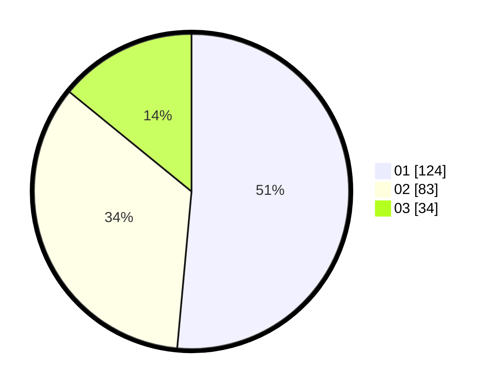

# Hasil

Hasil perolehan suara paslon dapat dilihat pada file paslon-01.txt, paslon-02.txt, dan paslon-03.txt.

Jika tidak ada, artinya data tersebut belum ada pada SIREKAP.

## Perolehan Suara

 * Paslon 01: **124**.
 * Paslon 02: **83**.
 * Paslon 03: **34**.

## Foto C Plano

https://sirekap-obj-formc.kpu.go.id/6f31/pemilu/ppwp/31/75/07/10/06/3175071006062-20240215-235244--177b68e6-5e70-4822-bc29-dbc19242b364.jpg

https://sirekap-obj-formc.kpu.go.id/6f31/pemilu/ppwp/31/75/07/10/06/3175071006062-20240215-163854--fee645f4-de35-4fc2-bda0-783b82353d72.jpg
