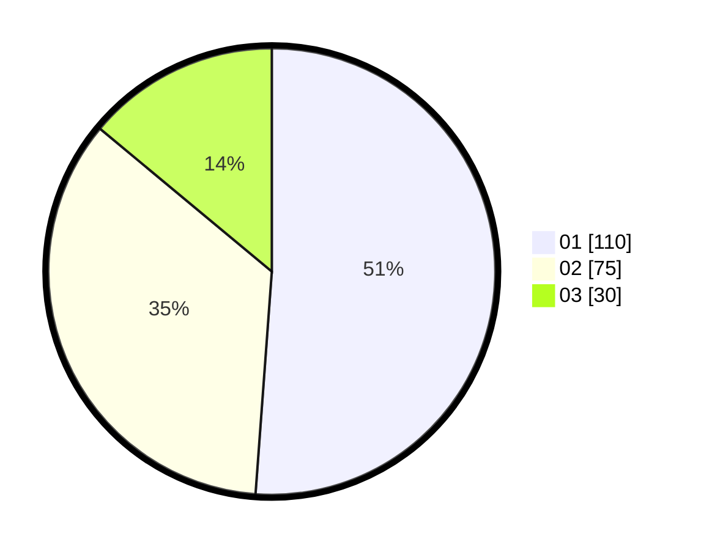

# Hasil

Hasil perolehan suara paslon dapat dilihat pada file paslon-01.txt, paslon-02.txt, dan paslon-03.txt.

Jika tidak ada, artinya data tersebut belum ada pada SIREKAP.

## Perolehan Suara

 * Paslon 01: **110**.
 * Paslon 02: **75**.
 * Paslon 03: **30**.

## Foto C Plano

https://sirekap-obj-formc.kpu.go.id/b153/pemilu/ppwp/31/75/07/10/06/3175071006063-20240215-030753--5d5089f9-37b3-4588-964f-3fa204029025.jpg

https://sirekap-obj-formc.kpu.go.id/b153/pemilu/ppwp/31/75/07/10/06/3175071006063-20240215-030847--9dbd5202-89b9-48aa-ace1-d2d19279fd12.jpg

https://sirekap-obj-formc.kpu.go.id/b153/pemilu/ppwp/31/75/07/10/06/3175071006063-20240215-031036--f970de41-83bd-4bb7-909f-4a81da54b403.jpg
