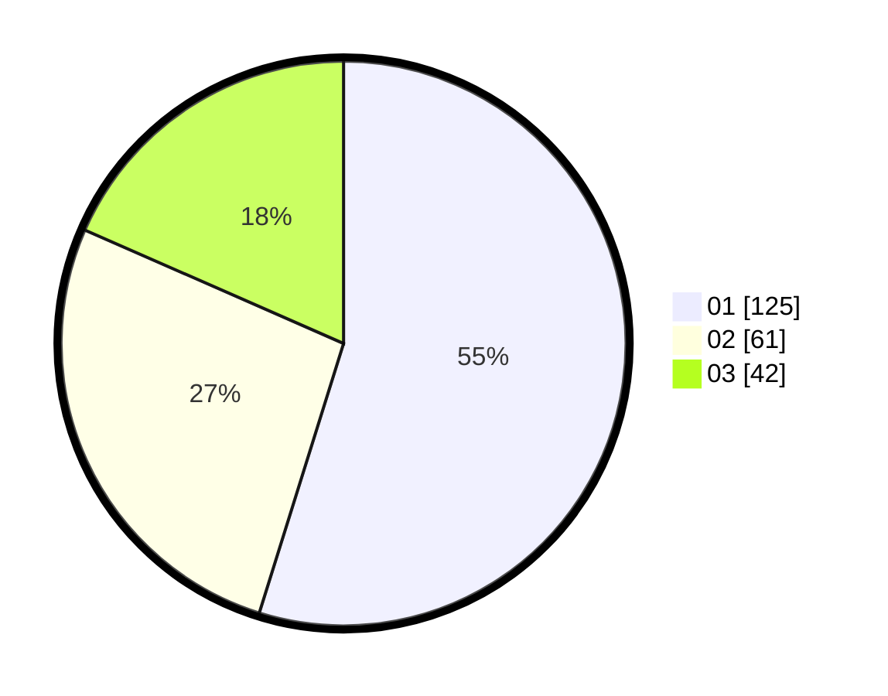

# Hasil

Hasil perolehan suara paslon dapat dilihat pada file paslon-01.txt, paslon-02.txt, dan paslon-03.txt.

Jika tidak ada, artinya data tersebut belum ada pada SIREKAP.

## Perolehan Suara

 * Paslon 01: **125**.
 * Paslon 02: **61**.
 * Paslon 03: **42**.

## Foto C Plano

https://sirekap-obj-formc.kpu.go.id/0ed8/pemilu/ppwp/31/75/07/10/06/3175071006064-20240216-054838--4c244dcb-083d-49a8-843f-e5efecab3fe2.jpg

https://sirekap-obj-formc.kpu.go.id/0ed8/pemilu/ppwp/31/75/07/10/06/3175071006064-20240216-054854--704c790f-6a6c-4854-8374-3b7029f1133a.jpg

https://sirekap-obj-formc.kpu.go.id/0ed8/pemilu/ppwp/31/75/07/10/06/3175071006064-20240216-054846--3fdd8e2c-b4cf-44c9-8f94-f0d590e6571d.jpg

## DATA PEMILIH TETAP

Jumlah pemilih dalam DPT: **258**.
 * L: **115**.
 * P: **143**.

## DATA PENGGUNA HAK PILIH

Jumlah pengguna hak pilih dalam DPT: **225**.
 * L: **100**.
 * P: **125**.

Jumlah pengguna hak pilih dalam DPTb: **3**.
 * L: **1**.
 * P: **2**.

Jumlah pengguna hak pilih dalam DPK: **0**.
 * L: **0**.
 * P: **0**.

Jumlah pengguna hak pilih: **228**.
 * L: **101**.
 * P: **127**.

## JUMLAH SUARA SAH DAN TIDAK SAH

JUMLAH SELURUH SUARA SAH: **228**.

JUMLAH SUARA TIDAK SAH: **0**.

JUMLAH SELURUH SUARA SAH DAN SUARA TIDAK SAH: **228**.
