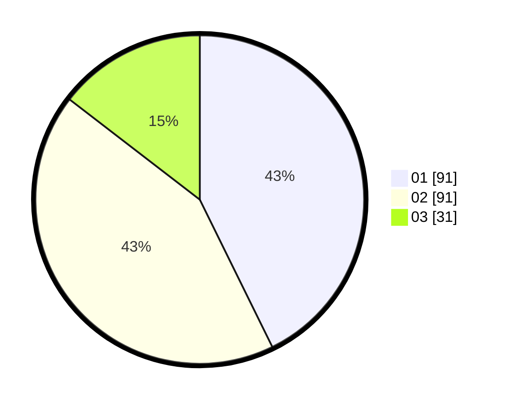

# Hasil

Hasil perolehan suara paslon dapat dilihat pada file paslon-01.txt, paslon-02.txt, dan paslon-03.txt.

Jika tidak ada, artinya data tersebut belum ada pada SIREKAP.

## Perolehan Suara

 * Paslon 01: **91**.
 * Paslon 02: **91**.
 * Paslon 03: **31**.

## Foto C Plano

https://sirekap-obj-formc.kpu.go.id/eb36/pemilu/ppwp/31/75/07/10/06/3175071006072-20240216-142304--6b476edb-7e67-41a4-8bcf-106d971a7886.jpg

https://sirekap-obj-formc.kpu.go.id/eb36/pemilu/ppwp/31/75/07/10/06/3175071006072-20240216-142305--469f1a17-0cea-442e-b6f5-b13f253c5fe8.jpg

https://sirekap-obj-formc.kpu.go.id/eb36/pemilu/ppwp/31/75/07/10/06/3175071006072-20240216-142305--c5136631-a9c5-404e-bb61-92d31619c176.jpg

## DATA PEMILIH TETAP

Jumlah pemilih dalam DPT: **0**.
 * L: **0**.
 * P: **0**.

## DATA PENGGUNA HAK PILIH

Jumlah pengguna hak pilih dalam DPT: **0**.
 * L: **0**.
 * P: **0**.

Jumlah pengguna hak pilih dalam DPTb: **0**.
 * L: **0**.
 * P: **0**.

Jumlah pengguna hak pilih dalam DPK: **0**.
 * L: **0**.
 * P: **0**.

Jumlah pengguna hak pilih: **0**.
 * L: **0**.
 * P: **0**.

## JUMLAH SUARA SAH DAN TIDAK SAH

JUMLAH SELURUH SUARA SAH: **213**.

JUMLAH SUARA TIDAK SAH: **2**.

JUMLAH SELURUH SUARA SAH DAN SUARA TIDAK SAH: **215**.
