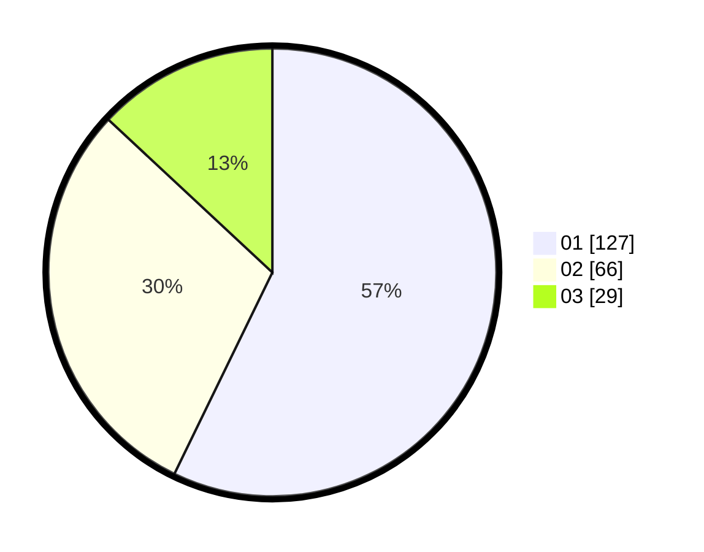

# Hasil

Hasil perolehan suara paslon dapat dilihat pada file paslon-01.txt, paslon-02.txt, dan paslon-03.txt.

Jika tidak ada, artinya data tersebut belum ada pada SIREKAP.

## Perolehan Suara

 * Paslon 01: **127**.
 * Paslon 02: **66**.
 * Paslon 03: **29**.

## Foto C Plano

https://sirekap-obj-formc.kpu.go.id/e42a/pemilu/ppwp/31/75/07/10/06/3175071006073-20240214-155436--6e2917be-bf79-4c58-999f-81f79bc66989.jpg

https://sirekap-obj-formc.kpu.go.id/e42a/pemilu/ppwp/31/75/07/10/06/3175071006073-20240216-111902--55c9f73f-bfab-41bb-bee4-6dc990e24f04.jpg

https://sirekap-obj-formc.kpu.go.id/e42a/pemilu/ppwp/31/75/07/10/06/3175071006073-20240216-111953--01feadff-df86-47fd-a407-dbb1eb08bbfd.jpg

## DATA PEMILIH TETAP

Jumlah pemilih dalam DPT: **264**.
 * L: **133**.
 * P: **131**.

## DATA PENGGUNA HAK PILIH

Jumlah pengguna hak pilih dalam DPT: **219**.
 * L: **108**.
 * P: **111**.

Jumlah pengguna hak pilih dalam DPTb: **4**.
 * L: **3**.
 * P: **1**.

Jumlah pengguna hak pilih dalam DPK: **4**.
 * L: **2**.
 * P: **2**.

Jumlah pengguna hak pilih: **227**.
 * L: **113**.
 * P: **114**.

## JUMLAH SUARA SAH DAN TIDAK SAH

JUMLAH SELURUH SUARA SAH: **222**.

JUMLAH SUARA TIDAK SAH: **5**.

JUMLAH SELURUH SUARA SAH DAN SUARA TIDAK SAH: **227**.
