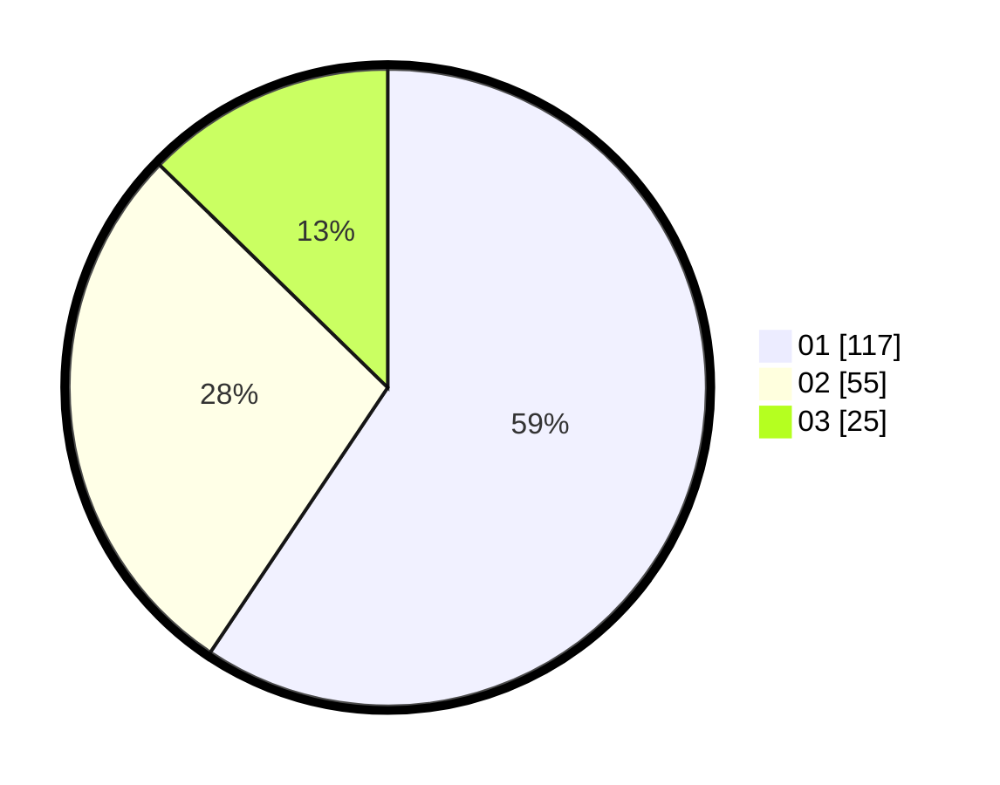

# Hasil

Hasil perolehan suara paslon dapat dilihat pada file paslon-01.txt, paslon-02.txt, dan paslon-03.txt.

Jika tidak ada, artinya data tersebut belum ada pada SIREKAP.

## Perolehan Suara

 * Paslon 01: **117**.
 * Paslon 02: **55**.
 * Paslon 03: **25**.

## Foto C Plano

https://sirekap-obj-formc.kpu.go.id/6f85/pemilu/ppwp/31/75/07/10/06/3175071006080-20240216-131232--9349025f-7a54-4272-a909-c807ddc897d6.jpg

https://sirekap-obj-formc.kpu.go.id/6f85/pemilu/ppwp/31/75/07/10/06/3175071006080-20240216-131233--d97d5903-5962-443e-b8b7-8e8774355ef2.jpg

https://sirekap-obj-formc.kpu.go.id/6f85/pemilu/ppwp/31/75/07/10/06/3175071006080-20240216-131232--c92e2d5f-967e-4ec3-932e-cc3b809d9621.jpg

## DATA PEMILIH TETAP

Jumlah pemilih dalam DPT: **239**.
 * L: **105**.
 * P: **134**.

## DATA PENGGUNA HAK PILIH

Jumlah pengguna hak pilih dalam DPT: **198**.
 * L: **86**.
 * P: **112**.

Jumlah pengguna hak pilih dalam DPTb: **3**.
 * L: **1**.
 * P: **2**.

Jumlah pengguna hak pilih dalam DPK: **0**.
 * L: **0**.
 * P: **0**.

Jumlah pengguna hak pilih: **201**.
 * L: **87**.
 * P: **114**.

## JUMLAH SUARA SAH DAN TIDAK SAH

JUMLAH SELURUH SUARA SAH: **197**.

JUMLAH SUARA TIDAK SAH: **2**.

JUMLAH SELURUH SUARA SAH DAN SUARA TIDAK SAH: **199**.
