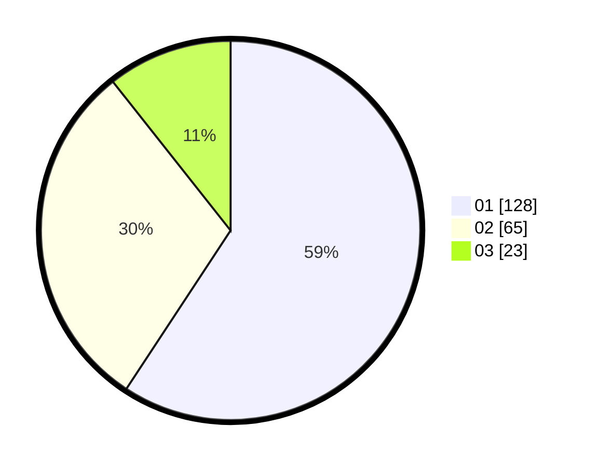

# Hasil

Hasil perolehan suara paslon dapat dilihat pada file paslon-01.txt, paslon-02.txt, dan paslon-03.txt.

Jika tidak ada, artinya data tersebut belum ada pada SIREKAP.

## Perolehan Suara

 * Paslon 01: **128**.
 * Paslon 02: **65**.
 * Paslon 03: **23**.

## Foto C Plano

https://sirekap-obj-formc.kpu.go.id/022e/pemilu/ppwp/31/75/07/10/06/3175071006091-20240214-191036--9391c5aa-7505-4de9-8221-040942aa8f2b.jpg

https://sirekap-obj-formc.kpu.go.id/022e/pemilu/ppwp/31/75/07/10/06/3175071006091-20240214-185506--369b62d9-1079-4b62-80f8-9ae1ee70864d.jpg

https://sirekap-obj-formc.kpu.go.id/022e/pemilu/ppwp/31/75/07/10/06/3175071006091-20240214-190848--df85c910-feae-461c-a6f9-177da73e081c.jpg

## DATA PEMILIH TETAP

Jumlah pemilih dalam DPT: **265**.
 * L: **122**.
 * P: **143**.

## DATA PENGGUNA HAK PILIH

Jumlah pengguna hak pilih dalam DPT: **215**.
 * L: **89**.
 * P: **126**.

Jumlah pengguna hak pilih dalam DPTb: **1**.
 * L: **1**.
 * P: **0**.

Jumlah pengguna hak pilih dalam DPK: **2**.
 * L: **0**.
 * P: **2**.

Jumlah pengguna hak pilih: **218**.
 * L: **90**.
 * P: **128**.

## JUMLAH SUARA SAH DAN TIDAK SAH

JUMLAH SELURUH SUARA SAH: **216**.

JUMLAH SUARA TIDAK SAH: **2**.

JUMLAH SELURUH SUARA SAH DAN SUARA TIDAK SAH: **218**.
